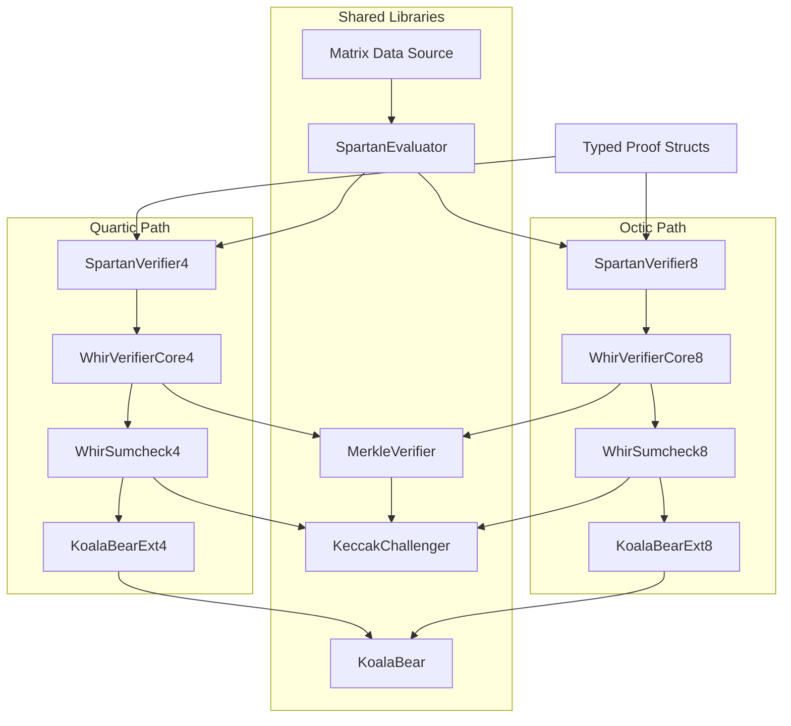

# Spartan-WHIR Solidity Verifier Implementation Plan

## Background

The `spartan-whir` Rust crate implements a SNARK (Succinct Non-interactive Argument of Knowledge) that combines:

- **Spartan**: an R1CS-based SNARK that reduces constraint satisfaction to polynomial evaluation claims via two sumcheck protocols (an outer cubic sumcheck and an inner quadratic sumcheck).
- **WHIR**: a polynomial commitment scheme (PCS) based on Reed-Solomon proximity testing. WHIR uses iterative folding rounds, each consisting of a Merkle commitment, out-of-domain (OOD) sampling, STIR query verification, and a folding sumcheck. It serves as the backend that opens the witness polynomial at the point produced by Spartan.

The base field is **KoalaBear** (p = 2^31 - 2^24 + 1, a 31-bit prime from the Plonky3 library). Algebraic security requires working over extension fields: degree-4 (quartic) or degree-8 (octic) binomial extensions of KoalaBear, both using the irreducible polynomial X^d - 3.

The goal of this plan is to build a **Solidity verifier** for this proof system, deployable on Ethereum-compatible EVM chains. The verifier must reproduce the exact Fiat-Shamir transcript and verification logic of the Rust implementation.

### Existing Codebases (in the same workspace)

- `./spartan-whir/` -- Rust SNARK implementation. Contains the protocol logic, proof encoding (`codec_v1.rs`), Keccak hashing (`hashers.rs`), domain separator (`domain_separator.rs`), and the WHIR PCS integration (`whir_pcs.rs`). This is the **source of truth** for all verification logic.
- `./whir-p3/` -- Rust WHIR library used by `spartan-whir`. Contains the WHIR verifier (`whir/verifier/mod.rs`), sumcheck verifier (`whir/verifier/sumcheck.rs`), Merkle multiproof verification (`whir/merkle_multiproof.rs`), proof types (`whir/proof.rs`), and expanded config derivation (`whir/parameters.rs`).
- `./Plonky3/` -- Vendored Plonky3 library. Contains the KoalaBear field definition (`koala-bear/src/koala_bear.rs`) and extension field arithmetic (`field/src/extension/binomial_extension.rs`).
- `./sol-whir/` -- An older Solidity verifier for a **different** version of WHIR over the BN254 field. Useful as a **structural reference** for Foundry project layout, gas measurement patterns, Merkle queue-based multiproof verification, and test harness design. **Not usable as a logic source** because its WHIR state machine matches the older `whir-old` Rust implementation, not the current `whir-p3`.
- `./whir-old/` -- Older Rust WHIR implementation (BN254-based). Only useful as a workflow reference for the fixture export pipeline. Not a schema or logic reference.

## Summary

Create a new Foundry (Solidity) project at `./sol-spartan-whir/`. Canonical protocol logic stays in `./spartan-whir/`. Fixture export and Solidity code generation live in a separate Rust workspace crate at `./spartan-whir-export/`.

Implementation order:

1. Freeze the ABI schema, set up the Foundry project, build the Rust fixture exporter
2. Implement KoalaBear base-field and extension-field arithmetic in Solidity
3. Implement the Keccak transcript challenger, validated against exported Rust traces
4. Implement the Merkle multiproof verifier
5. Implement the standalone WHIR verifier (quartic first, then octic) and perform the main WHIR optimization pass there
6. Implement the full Spartan verifier on top of standalone WHIR
7. Optimize only the remaining Spartan-specific or deployment-path hotspots
8. Add a binary blob wrapper over the typed verifier for calldata optimization

The internal architecture supports **octic (degree-8) extensions from the start**, but the first working verifier targets **quartic (degree-4) standalone WHIR**.

## Source-of-Truth Boundaries

**Use `./sol-whir/` only for structural reference:**

- Foundry project layout and configuration patterns
- Gas measurement harness (`vm.startSnapshotGas` / `vm.stopSnapshotGas`)
- Merkle queue-based multiproof verification structure
- Test and deployment script patterns

**Do not use `./sol-whir/` as a logic source.** Its WHIR verification state machine corresponds to `./whir-old/`, not the current `./whir-p3/`.

**Use the current Rust code as the logic source for all verification logic:**

- WHIR verifier: [whir-p3/src/whir/verifier/mod.rs](whir-p3/src/whir/verifier/mod.rs), [whir-p3/src/whir/verifier/sumcheck.rs](whir-p3/src/whir/verifier/sumcheck.rs)
- WHIR PCS integration (split `parseCommitment` / `finalize` API): [spartan-whir/src/whir_pcs.rs](spartan-whir/src/whir_pcs.rs)
- Spartan verifier: [spartan-whir/src/protocol.rs](spartan-whir/src/protocol.rs), [spartan-whir/src/sumcheck.rs](spartan-whir/src/sumcheck.rs)
- Spartan domain separator: [spartan-whir/src/domain_separator.rs](spartan-whir/src/domain_separator.rs)
- Keccak hashing and digest masking: [spartan-whir/src/hashers.rs](spartan-whir/src/hashers.rs)
- Merkle multiproof algorithm: [whir-p3/src/whir/merkle_multiproof.rs](whir-p3/src/whir/merkle_multiproof.rs)
- Extension field constants and arithmetic: [Plonky3/koala-bear/src/koala_bear.rs](Plonky3/koala-bear/src/koala_bear.rs), [Plonky3/field/src/extension/binomial_extension.rs](Plonky3/field/src/extension/binomial_extension.rs)

**Use `./whir-old/` proof-converter only as a workflow reference** for how fixture export pipelines are structured. It is not a schema or format reference for the current proof format.

## Locked Decisions

- **Fresh implementation.** Do not refactor `./sol-whir/` in place. Write new Solidity code, referencing `./sol-whir/` only for structural patterns.
- **Typed ABI first.** The first working verifier uses Solidity structs with standard ABI encoding. The Rust exporter produces binary `abi.encode(...)` payloads using the `alloy-sol-types` library. Solidity tests load these via `vm.readFileBinary` and decode with `abi.decode(...)`. Custom binary encoding (the `SPWB` blob format) is added later as an optimization wrapper in Stage 7.
- **Standalone WHIR first.** Build and validate the WHIR polynomial commitment verifier before adding the Spartan layer. The WHIR verifier is the more complex component and accounts for most of the gas cost.
- **Quartic first, octic second.** Quartic extensions (4 coefficients per element) are simpler to implement and debug. Octic extensions (8 coefficients) are added before the full Spartan verifier is considered complete.
- **Two concrete verifier families via template-generated specialization.** Solidity has no generics. Extension-dependent modules (`WhirVerifierCore`, `WhirSumcheck`, `SpartanSumcheck`) are written as templates with a placeholder extension library import. The `spartan-whir-export` crate performs simple string substitution to produce two specialized copies (e.g., `WhirVerifierCore4.sol` and `WhirVerifierCore8.sol`) with the correct extension library wired at code-generation time. Extension-independent modules (`KeccakChallenger`, `MerkleVerifier`, `KoalaBear`, `SpartanEvaluator`) are shared. There is no runtime branching or virtual function dispatch on extension degree.
- **Standalone WHIR uses fixed-config verifiers only.** `WhirVerifier4.sol` / `WhirVerifier8.sol` bake the derived WHIR schedule, Fiat-Shamir pattern, and digest configuration into generated Solidity constants. Solidity does not accept an `ExpandedWhirConfig`-style runtime ABI config.
- **Rust derives the schedule; Solidity consumes generated constants.** The exporter is responsible for deriving the verifier-ready round schedule and emitting Solidity constants for the chosen configuration. If the schedule changes later, regenerate fixtures and generated Solidity; do not reintroduce a runtime-config verifier path.
- **Circuit-specific full Spartan verifier via generated Solidity.** The Rust code-generation tool emits Solidity constant definitions and sparse R1CS matrix data for a specific circuit. The `SpartanEvaluator` reads this data to verify inner relation checks. For any non-trivial circuit, the matrix data will exceed the EVM's 24576-byte contract size limit if stored inline. Therefore, the `SpartanEvaluator` API is designed from the start to abstract over the data source: inline constants for small test circuits, auxiliary code-as-data contracts (read via `EXTCODECOPY`) for realistic circuits. This transition does not change the evaluator's function signatures.
- **Optimization after Stage 4 correctness, not at the very end.** The baseline arithmetic uses simple, obviously-correct modular reductions (one reduction per operation), but the main WHIR hot-kernel optimization pass belongs in Stage 4 immediately after standalone correctness and first gas numbers. Later stages should keep only Spartan-specific or deployment-path optimization work that cannot be decided earlier.

## Typed ABI Schema (Frozen)

All Solidity-facing proof and config structs are defined in Stage 0 before the Rust exporter is built. Both sides target the same schema. The Rust exporter and Solidity verifier must agree on these definitions exactly.

### Encoding conventions

- **Digests**: `bytes32`. Represents a Keccak-based Merkle digest (internally `[u64; 4]`, serialized as 32 bytes in big-endian u64 order, with trailing bytes masked to `effectiveDigestBytes`).
- **Base-field elements**: `uint256`. One KoalaBear element per word, right-aligned, value in `[0, p)` where p = 0x7f000001.
- **Extension-field elements**: `uint256`. One packed extension element per word. Quartic: 4 coefficients x 32 bits each = 128 bits used. Octic: 8 coefficients x 32 bits each = 256 bits used. Coefficient order within the word is big-endian (coefficient 0 in the most significant 32-bit slot).
- **Important**: the byte order used for packing extension elements into `uint256` words (the ABI representation) and the byte order used by the Keccak transcript challenger when serializing field elements are **independent**. Both must be matched against Rust traces separately. Do not assume they are the same.

### Proof structs

**QueryBatchOpening** (Merkle query opening for one round):

- `uint8 kind` -- `0` = base-field values, `1` = extension-field values. This tag is explicit (not inferred from round index) because the final query batch sits outside the round list and the distinction must remain explicit. Matches the Rust enum at [whir-p3/src/whir/proof.rs](whir-p3/src/whir/proof.rs) line 117 and the codec variant byte at [spartan-whir/src/codec_v1.rs](spartan-whir/src/codec_v1.rs) line 913.
- `uint256 numQueries`
- `uint256 rowLen`
- `uint256[] values` -- flat row-major array. For base queries, each value is one `uint256` base-field element. For extension queries, each value is one `uint256` packed extension element.
- `bytes32[] decommitments` -- Merkle sibling hashes for the multiproof.

**SumcheckData** (WHIR folding sumcheck data for one phase):

- `uint256[] polynomialEvals` -- c0 and c2 values interleaved: `[c0_round0, c2_round0, c0_round1, c2_round1, ...]`. Each value is an extension element. Total length = 2 number_of_rounds.
- `uint256[] powWitnesses` -- proof-of-work witnesses, one base-field element per round.

**WhirRoundProof** (data for one WHIR folding round):

- `bytes32 commitment` -- Merkle root for this round's committed table.
- `uint256[] oodAnswers` -- out-of-domain evaluation answers (extension elements).
- `uint256 powWitness` -- proof-of-work witness (base-field element).
- `QueryBatchOpening queryBatch` -- Merkle query opening for this round.
- `SumcheckData sumcheck` -- folding sumcheck data for this round.

**WhirProof** (complete WHIR proof):

- `bytes32 initialCommitment` -- Merkle root of the initial committed polynomial.
- `uint256[] initialOodAnswers` -- out-of-domain evaluation answers for the initial commitment (extension elements).
- `SumcheckData initialSumcheck` -- initial folding sumcheck data.
- `WhirRoundProof[] rounds` -- one entry per WHIR folding round.
- `uint256[] finalPoly` -- **required** (not optional). The full evaluation table of the final residual polynomial over the remaining Boolean hypercube (extension elements, length = `2^finalSumcheckRounds`). The prover always populates this field. The verifier will reject the proof if it is missing ([whir-p3/src/whir/verifier/mod.rs](whir-p3/src/whir/verifier/mod.rs) line 152). The Solidity verifier should also reject if the decoded length is not exactly `2^finalSumcheckRounds`. The same vector is used in two ways by the verifier: final STIR checks interpret it as coefficients of a univariate polynomial and evaluate it via Horner's method, while the final sumcheck check interprets it as multilinear hypercube evaluations and evaluates it at the final sumcheck point.
- `uint256 finalPowWitness` -- proof-of-work witness for the final phase.
- `bool finalQueryBatchPresent` -- `true` if the generated fixed configuration expects a final STIR query batch.
- `QueryBatchOpening finalQueryBatch` -- final STIR query opening. When `finalQueryBatchPresent` is `false`, this struct is present but contains empty/zero values.
- `bool finalSumcheckPresent` -- `true` if `finalSumcheckRounds > 0` in the config.
- `SumcheckData finalSumcheck` -- final sumcheck data. When `finalSumcheckPresent` is `false`, this struct is present but contains empty arrays.

**Note on nesting:** The typed ABI allows nested structs and dynamic arrays where needed (e.g., `WhirRoundProof[]` inside `WhirProof`). Within each struct, variable-length data uses flat arrays with explicit counts rather than deeper nesting. This schema prioritizes correctness and ease of debugging over calldata efficiency. Further flattening is deferred to the blob stage (Stage 7).

### Statement structs

The fixed verifier still accepts the evaluation statement at runtime. The derived WHIR schedule itself is not part of the Solidity ABI; Rust exports it as generated Solidity constants instead.

**WhirStatement** (matches the point-evaluation claims produced by the Spartan layer):

- `uint256[][] points` -- each inner array is a multilinear evaluation point (extension elements).
- `uint256[] evaluations` -- claimed polynomial evaluations at the corresponding points (extension elements, one per point).

**SpartanInstance** (runtime input for the full Spartan verifier, separate from the proof):

- `uint256[] publicInputs` -- public inputs to the R1CS circuit (base-field elements).
- `bytes32 witnessCommitment` -- Merkle root digest of the committed witness polynomial.

**SpartanProof** (complete Spartan proof):

- `uint256[] outerSumcheckPolys` -- flat array of outer sumcheck round polynomials. Each round contributes 3 extension elements [h0, h2, h3] (`CubicRoundPoly`). Total length = 3 num_rounds_x.
- `uint256[3] outerClaims` -- the three outer sumcheck output claims (Az, Bz, Cz) as extension elements.
- `uint256[] innerSumcheckPolys` -- flat array of inner sumcheck round polynomials. Each round contributes 2 extension elements [h0, h2] (`QuadraticRoundPoly`). Total length = 2 num_rounds_y.
- `uint256 witnessEval` -- claimed witness polynomial evaluation at the inner sumcheck output point (extension element).
- `WhirProof pcsProof` -- the nested WHIR proof for the polynomial commitment opening.

The quartic and octic ABI layouts are identical. The only difference is how the `uint256` extension words are interpreted (4 vs 8 packed 32-bit coefficients). The extension degree is a config-level constant, not a runtime variant in the proof struct.

The full Spartan ABI (SpartanInstance + SpartanProof) is frozen before Stage 5 starts.

## Workspace Structure

```
spartan-p3/
+-- spartan-whir/         # Rust SNARK implementation (source of truth for protocol logic)
+-- spartan-whir-export/  # Rust crate for fixture export and Solidity code generation
|                         # depends on spartan-whir + alloy-sol-types
|                         # writes binary ABI-encoded test fixtures to sol-spartan-whir/testdata/
|                         # emits generated Solidity constants to sol-spartan-whir/src/generated/
|                         # emits template-specialized Core4/Core8 Solidity files
+-- whir-p3/              # Rust WHIR library (PCS backend)
+-- Plonky3/              # Vendored Plonky3 (field definitions and extension arithmetic)
+-- sol-spartan-whir/     # NEW Foundry project (Solidity verifier)
|   +-- foundry.toml
|   +-- src/
|   |   +-- field/
|   |   |   +-- KoalaBear.sol          # base-field arithmetic
|   |   |   +-- KoalaBearExt4.sol      # quartic extension arithmetic
|   |   |   +-- KoalaBearExt8.sol      # octic extension arithmetic
|   |   +-- transcript/
|   |   |   +-- KeccakChallenger.sol   # Fiat-Shamir transcript challenger
|   |   +-- merkle/
|   |   |   +-- MerkleVerifier.sol     # Merkle multiproof verification
|   |   +-- whir/
|   |   |   +-- WhirStructs.sol        # proof/config/statement struct definitions
|   |   |   +-- WhirSumcheck4.sol      # template-generated, uses KoalaBearExt4
|   |   |   +-- WhirSumcheck8.sol      # template-generated, uses KoalaBearExt8
|   |   |   +-- WhirVerifierCore4.sol  # template-generated, uses KoalaBearExt4
|   |   |   +-- WhirVerifierCore8.sol  # template-generated, uses KoalaBearExt8
|   |   |   +-- WhirVerifier4.sol      # quartic fixed-config wrapper (benchmarks/production)
|   |   |   +-- WhirVerifier8.sol      # octic fixed-config wrapper
|   |   +-- spartan/
|   |   |   +-- SpartanStructs.sol     # Spartan-level struct definitions
|   |   |   +-- SpartanSumcheck4.sol   # template-generated, uses KoalaBearExt4
|   |   |   +-- SpartanSumcheck8.sol   # template-generated, uses KoalaBearExt8
|   |   |   +-- SpartanEvaluator.sol   # sparse matrix evaluator (data-source abstracted)
|   |   |   +-- SpartanVerifier4.sol   # quartic fixed-config wrapper
|   |   |   +-- SpartanVerifier8.sol   # octic fixed-config wrapper
|   |   +-- generated/                 # Rust-emitted circuit-specific constants
|   +-- test/
|   |   +-- field/                     # arithmetic differential tests
|   |   +-- transcript/                # transcript parity tests
|   |   +-- whir/                      # standalone WHIR success/failure tests
|   |   +-- spartan/                   # full Spartan success/failure tests
|   |   +-- gas/                       # gas snapshot benchmarks
|   +-- testdata/                      # binary ABI-encoded fixtures from Rust
|   +-- script/
|   +-- lib/                           # forge-std, solady
+-- sol-whir/             # old BN254 WHIR verifier (structural REFERENCE ONLY)
+-- whir-old/             # old WHIR Rust implementation (workflow REFERENCE ONLY)
```

## Small-Field Arithmetic Design

KoalaBear: p = 2^31 - 2^24 + 1 (31-bit prime, 0x7f000001).

Both quartic and octic extensions use the binomial irreducible polynomial X^d - 3, where d is the extension degree and W = 3 is the non-residue. The `mul_by_w` operation is therefore `a * 3 = a + a + a` (no modular multiplication needed). Reference: [Plonky3/koala-bear/src/koala_bear.rs](Plonky3/koala-bear/src/koala_bear.rs) lines 91-127.

- **Quartic (d=4):** 4 coefficients per element. Multiplication requires approximately 16 base-field multiplications plus W-scaling. Reference for the algorithm: [Plonky3/field/src/extension/binomial_extension.rs](Plonky3/field/src/extension/binomial_extension.rs) `quartic_mul`.
- **Octic (d=8):** 8 coefficients per element. Multiplication requires approximately 64 base-field multiplications plus W-scaling. Inversion uses tower decomposition (treating the octic extension as a quadratic extension of the quartic extension). Reference: same file, `octic_mul` (line 1250) and `octic_inv` (line 1298).

**Why small-field arithmetic helps on the EVM:** A KoalaBear base-field multiplication produces a 62-bit result (31 bits x 31 bits), which fits in a single EVM `uint256` word with room to spare. This means a `uint256` accumulator can hold the sum of many such products (up to ~2^194 of them) before requiring a single modular reduction. Inside hot loops -- such as the dot products within extension multiplication, or multilinear evaluation folds -- this allows accumulating many terms before one `mod` operation, significantly reducing gas compared to performing `mulmod` on every operation.

**Baseline approach (Stage 1):** The first implementation uses simple, obviously-correct reductions: each arithmetic operation reduces its result modulo p immediately. Performance-critical functions are isolated as separate internal functions so that optimized variants with delayed reduction can replace them later without changing their callers.

## Implementation Stages

### Stage 0: Freeze schema + Foundry setup + Rust export tooling

**Sequencing:**

1. Define the Solidity struct definitions (`WhirStructs.sol`, `SpartanStructs.sol`) matching the frozen ABI schema above. These structs are the shared contract between the Rust exporter and the Solidity verifier.
2. Initialize `./sol-spartan-whir/` with Foundry. Configuration: `solc = "0.8.28"`, `fs_permissions` for testdata access, `via_ir = true`. Install dependencies: `forge-std`, `solady` (provides `LibSort` for STIR query index sorting). Verify that `vm.readFileBinary` is available in the installed Foundry version.
3. Build the Rust exporter as a separate workspace crate (`./spartan-whir-export/`) that depends on both `spartan-whir` and `alloy-sol-types`. This keeps the ABI-encoding dependency out of the core cryptographic crate. If a separate crate is impractical, the exporter can be placed under `spartan-whir/examples/` with `alloy-sol-types` as a dev-dependency only. The exporter uses `alloy-sol-types` to produce `abi.encode(...)`-compatible binary payloads. No hand-written ABI encoding.

**Rust exporter outputs:**

- Quartic standalone WHIR success and failure fixtures (binary ABI-encoded, loaded in Solidity via `vm.readFileBinary` + `abi.decode`). The initial failure set should include at least:
  - tampered commitment
  - tampered STIR query opening with commitments and OOD answers left unchanged
  - tampered initial OOD answer (expected to surface as an OOD failure and/or downstream transcript mismatch)
- Transcript checkpoint traces: every `observe`, `sample`, `sample_bits`, and `grind` call recorded in canonical replay form. Export the exact absorbed bytes for observe events, the sampled outputs for challenge events, and a separate checkpoint sample after the replay trace. Use this trace artifact for byte-level Solidity parity tests; do not rely on Rust debug-string dumps of challenger state.
- Field arithmetic test vectors: random tuples (a, b, a+b, a-b, ab, a^-1) for base field, quartic extension, and octic extension
- Merkle test vectors: leaf hashes, node compressions, multiproof verification cases
- The exact WHIR Fiat-Shamir domain-separator pattern (the `Vec<F>` from `DomainSeparator::observe_domain_separator`) for the chosen config, exported as a test vector. Record the pattern length in fixture metadata for bytecode-size estimation.
- Later (as needed by subsequent stages): octic WHIR fixtures, full Spartan fixtures, SPWB blobs

### Stage 1: Arithmetic layer

- `field/KoalaBear.sol`: base-field add, sub, mul, inv for p = 0x7f000001.
- `field/KoalaBearExt4.sol`: quartic extension arithmetic (first target).
- `field/KoalaBearExt8.sol`: octic extension arithmetic (added before the full Spartan verifier stage).
- Both extension libraries implement the same function interface: `add`, `sub`, `mul`, `inv`, `mul_by_w`.
- Isolate performance-critical functions as separate internal functions:
  - Coefficient unpack/pack (between packed `uint256` and individual coefficients)
  - Base-field multiply and reduce
  - Dot-product accumulation (in the baseline, this can stay inside `_mul_coeffs`. Later, in Stage 4, we can replace the internals of `_mul_coeffs` with a faster delayed-reduction version, or a fused version (combine multiple steps into one pass to avoid repeated unpack/pack and temporary intermediates), without changing callers.)
  - Multilinear fold and equality-polynomial evaluation helpers
  - Sumcheck round evaluation (`extrapolate_012`: Lagrange extrapolation through points 0, 1, 2)
- Validate representation choices (how coefficients are packed into `uint256`) with gas microbenchmarks.
- Early microbenchmark of `evaluate_hypercube_ext` (multilinear fold over 2^folding_factor points using extension arithmetic). This is expected to be the single most expensive function in the WHIR verifier. Profile its gas cost before building the full verifier.
- All arithmetic must pass differential tests against the Rust-exported test vectors.

### Stage 2: Challenger / transcript parity

- Start this stage with transcript traces generated from the current Rust baseline schedule (`FoldingFactor::Constant(whir.folding_factor)`). The challenger implementation itself is schedule-agnostic; if the schedule is changed later, regenerate the traces for the chosen schedule and rerun the same parity tests.
- Implement `KeccakChallenger.sol` to match the behavior of the Rust `SerializingChallenger32<KoalaBear, HashChallenger<u8, Keccak256Hash, 32>>` path used by `spartan-whir`.
- **Do not implement the challenger from documentation or memory. Implement it from exported Rust transcript traces.** The only safe specification is "the Solidity challenger must produce the exact same observe/sample sequence as the Rust challenger, byte for byte, on the same inputs."
- Export the transcript trace in a replay-friendly typed format (for example, ABI-encoded or structured JSON): observe events carry the exact absorbed bytes, challenge events carry the expected sampled values, and the checkpoint sample is kept separate from the replay event list. The Solidity Stage 2 tests should consume this canonical trace artifact directly.
- Spartan transcript context observation (reference: [spartan-whir/src/protocol.rs](spartan-whir/src/protocol.rs) lines 313-318):
  1. Build the 76-byte `DomainSeparator::to_bytes()` preimage from the canonical R1CS shape, security config, and WHIR parameters.
  2. Compute `keccak256(preimage)` to produce a 32-byte digest.
  3. Observe that **32-byte digest** (as a `Hash<F, u8, 32>` object) into the challenger. Do **not** observe the raw 76-byte preimage.
  4. Observe each public input as a base-field element.
- WHIR domain-separator observation: Stage 0 exports the exact WHIR Fiat-Shamir pattern for each config. The fixed-config verifiers bake this pattern as a compile-time constant generated from Rust.
- Tests must compare observe-sequence parity, challenge-sequence parity, and full checkpoint parity against fixed Rust-generated fixtures.

### Stage 3: Merkle layer

- Implement domain-prefixed Keccak leaf and node hashing with digest masking.
- Leaf hash: `keccak256(0x00 || field_elements_as_big_endian_u32...)`, then mask all bytes beyond `effectiveDigestBytes` to zero. Reference: [spartan-whir/src/hashers.rs](spartan-whir/src/hashers.rs).
- Node compression: `keccak256(0x01 || left_32_bytes || right_32_bytes)`, then apply the same digest masking.
- Queue-based multiproof verification. The structural pattern comes from [sol-whir/src/merkle/MerkleVerifier.sol](sol-whir/src/merkle/MerkleVerifier.sol). The algorithm reference is [whir-p3/src/whir/merkle_multiproof.rs](whir-p3/src/whir/merkle_multiproof.rs).
- Validate Merkle root computation, query ordering, and multiproof shape against Rust-generated fixtures.
- The Merkle verifier expects **sorted** query indices. Sorting is performed by the WHIR verifier core (Stage 4) using Solady's `LibSort`, not by the Merkle verifier itself.

### Stage 4: Standalone WHIR verifier

Split the verifier into these Solidity files:

- `WhirSumcheck4.sol` / `WhirSumcheck8.sol`: sumcheck verification logic, template-generated with the correct extension library.
- `WhirVerifierCore4.sol` / `WhirVerifierCore8.sol`: round parsing, STIR query processing, fold computation, constraint evaluation, template-generated.
- `WhirVerifier4.sol` / `WhirVerifier8.sol`: thin wrappers with fixed (compile-time) configuration for gas benchmarks and production use.

The verification logic is based on the current `whir-p3` verifier ([whir-p3/src/whir/verifier/mod.rs](whir-p3/src/whir/verifier/mod.rs)), not the older `sol-whir`.

**Input range validation:** Base-field arithmetic (`KoalaBear.add`/`sub`/`mul`) assumes inputs are in `[0, p)` and does not check. This is safe for internally-produced values (all operations produce reduced outputs), but ABI-decoded proof data enters the field layer at the Stage 4 boundary. The proof-decode entry point must validate that every base-field element and every packed extension coefficient is `< MODULUS` before passing values into arithmetic. This is a system-boundary check, not a per-operation check.

**Stack depth and memory management:** The WHIR verification loop maintains many simultaneous variables: challenger state, running claimed evaluation, folding randomness accumulated across rounds, domain parameters, constraint state, and parsed commitment data. Solidity's 16-variable stack limit will require scoped blocks, memory structs, and helper functions in the baseline implementation. This is a structural requirement for the code to compile, not a deferred optimization. Memory-budget profiling (tracking temporary array sizes and peak memory usage) should be part of baseline gas measurement.

**PCS split semantics** (required for later Spartan integration):

The Solidity WHIR verifier exposes the same two-phase API as the Rust implementation in [spartan-whir/src/whir_pcs.rs](spartan-whir/src/whir_pcs.rs):

- **parseCommitment** (Rust: lines 147-166): observes the WHIR Fiat-Shamir domain-separator pattern into the challenger, parses the initial commitment (observes the Merkle root, samples OOD challenge points, observes OOD answers), and checks that the root matches the expected commitment. Returns a parsed-commitment state object. Does **not** run the initial sumcheck. The Solidity implementation reads all schedule and transcript constants from generated Solidity code emitted by the Rust exporter; it does not re-derive `WhirConfig` on-chain.
- **finalize** (Rust: lines 168-189): given the parsed commitment and the user's evaluation statement, runs `Verifier::verify`, which executes the full WHIR verification loop (initial sumcheck, per-round STIR + sumcheck, final check).

This split exists because the full Spartan verifier interleaves its own logic between the two phases: it calls `parseCommitment`, then runs the Spartan outer and inner sumchecks, then calls `finalize`. The standalone WHIR verifier simply calls both phases in sequence.

The full WHIR verification loop inside `finalize` (from [whir-p3/src/whir/verifier/mod.rs](whir-p3/src/whir/verifier/mod.rs)):

1. Merge the parsed commitment's OOD statement with the user-provided evaluation statement.
2. Build the initial constraint (`EqStatement` + `SelectStatement`), compute `combine_evals`.
3. Run the initial sumcheck using the generated first-round schedule constants for the chosen config.
4. For each WHIR round: read that round's generated parameters, parse the round commitment, check proof-of-work, sample STIR query indices (sample random bits from the challenger, construct indices, sort and deduplicate using Solady's `LibSort`), verify the Merkle multiproof (expects sorted indices), compute fold values via `evaluate_hypercube_ext` on the opened leaf rows, build the round's constraint, run the round's sumcheck.
5. Final phase: observe the final polynomial into the challenger, verify final STIR queries, run the optional final sumcheck (if the generated final-phase constants require it), check the closing equation via `ConstraintPolyEvaluator`.

**Milestones:**

1. Quartic standalone WHIR verifier passes Rust success fixtures.
2. Quartic verifier correctly rejects tampered proofs: tampered commitment, tampered initial OOD answer / transcript mismatch, tampered STIR query opening, tampered Merkle path or query data, tampered sumcheck data, transcript mismatch.
3. Generated fixed-config verifier matches the Rust-derived schedule and transcript constants for the chosen fixture family.
4. Octic standalone WHIR verifier passes using the same core logic with `WhirVerifier8.sol`.
5. Gas benchmarks for both quartic and octic configurations.

**Optimization work that belongs in Stage 4:**

Once quartic standalone WHIR correctness is passing and the first gas profile exists, keep the optimization loop inside Stage 4 until the major standalone WHIR hotspots are addressed. Do not defer these to the end of the project, because Stage 5 inherits the Stage 4 WHIR cost structure.

- Optimize only measured standalone WHIR hotspots:
  - fixed-config specialization and dead-code elimination
  - extension multiplication and accumulation
  - `_eqPolyEvalAt` / `_selectPolyEvalAt` loop restructuring and direct-data paths
  - multilinear fold kernels (`evaluate_hypercube_ext`)
  - sumcheck round evaluation (`extrapolate_012`)
  - Merkle verifier memory management / queue structure
  - challenger allocation / buffering, but only if profiling still shows transcript overhead is material after the arithmetic and constraint kernels above are optimized
  - octic inversion and octic-specific field kernels if octic Stage 4 profiling shows they are material
- Every accepted optimization requires:
  - differential tests against the previous reference kernel
  - before/after gas snapshots on identical fixtures
  - confirmation that proof format, transcript format, and public verifier ABI remain unchanged
- Stage 4 ends only after:
  - quartic and octic standalone WHIR both pass
  - the main standalone WHIR gas hotspots have been profiled and either optimized or explicitly deferred with a measured reason

**Current quartic fixed-config results (31 March 2026):**

- Accepted optimizations:
  - packed `_eqPolyEvalAt` term construction (`1 + 2pq - p - q` without intermediate ext4 add/sub/fromBase calls)
  - packed `_selectPolyEvalAt` term construction
  - packed ext4 `add` / `sub`
  - batched fixed Fiat-Shamir pattern observation (`observeBytes` over one precomputed byte string instead of many `observeBase` calls)
  - dedicated ext4 `square`
  - packed `observeExt4` absorption plus removal of redundant inner packed-ext4 validation in paths that are already batch-validated or Merkle-validated
  - fused final-select multiply (`_selectPolyEvalAt` multiplies the accumulator by the select term without materializing an intermediate packed term)
  - inline `sampleExt4` packing (sample four base elements directly into one packed ext4 value)
  - unchecked row loaders in STIR/final-row evaluators, relying on prior batch validation or Merkle leaf validation instead of re-validating every row element during folding
  - two-buffer Merkle frontier reuse in `_computeRootFromLeafHashes`, eliminating per-level frontier array allocation while preserving the existing deduplication behavior
  - corrected `_mulByEqTerm` path in `_eqPolyEvalAt`, eliminating the intermediate packed eq term without changing the final constraint result
  - fixed 20-byte Merkle digest specialization (`computeRootFromFlat*Rows20`, `hashLeaf*Slice20`, `compressNode20`) for the fixed-config verifier path
  - fused `_selectPolyEvalAt` accumulator loop (keep unpacked accumulator coefficients across the whole variable loop instead of re-unpacking per term)
  - fused `_eqPolyEvalAt` accumulator loop (same strategy while preserving the existing `p * q` computation)
  - fixed-only no-copy initial eq path in `WhirVerifier4` (remove `_statementFromCalldata` / `_concatenateEq` from the success path and treat user statement points plus OOD points as two logical segments)
  - direct packed-ext4 range checks in `validatePackedExt4` (remove `unpack()` memory allocation from verifier ingress and sumcheck validation)
  - dim-4 STIR row-fold specialization that pre-unpacks the four folding-randomness extension elements once per row and reuses their coefficients across all 15 folds
  - batched ext4 transcript absorption for contiguous fixed-path observations (`observePackedExt4Pair` in sumchecks and `observePackedExt4Slice` for `finalPoly`)
- Rejected optimization:
  - low-level `mulmod`/`addmod` rewrite of ext4 `mul`; it regressed both the microbenchmark and end-to-end verifier gas, so the earlier `_mul_packed` path remains the reference implementation
  - single-buffer in-place Merkle frontier reduction; the attempted queue rewrite changed verification behavior on the success fixture and was reverted
  - fused `_foldOnce`; the measured end-to-end gain was too small to justify the added specialized code
  - fused eq-term multiply inside `_eqPolyEvalAt`; it changed the final constraint result and was reverted
  - batch sumcheck validation; validating all `polynomialEvals` once at entry regressed gas versus the current per-round validation placement and was reverted
  - base-row scalar-aware first-fold rewrite; it regressed fixed-config verifier gas and was reverted
  - queue-style absolute-index Merkle reducer adapted from `sol-whir`; it under-consumed decommitments on the real WHIR query batches and was reverted after parity failed on the fixed verifier path
- Measured fixed-config quartic verifier gas on the current 16-variable, 2-round fixture family:
  - baseline before this pass: `5,793,929`
  - after packed `_eqPolyEvalAt`: `4,938,693`
  - after packed `_selectPolyEvalAt`: `4,293,271`
  - after packed ext4 `add` / `sub`: `2,508,365`
  - after batched fixed-pattern observation: `2,493,343`
  - after dedicated ext4 `square`: `2,484,127`
  - after packed `observeExt4` + validation elision: `2,147,564`
  - after fused final-select multiply: `2,012,019`
  - after inline `sampleExt4` packing: `1,993,480`
  - after unchecked STIR/final-row loaders: `1,984,723`
  - after two-buffer Merkle frontier reuse: `1,940,646`
  - after corrected `_mulByEqTerm`: `1,932,953`
  - after fixed 20-byte Merkle digest specialization: `1,893,047`
  - after fused `_selectPolyEvalAt` accumulator loop: `1,886,378`
  - after fused `_eqPolyEvalAt` accumulator loop: `1,883,228`
  - after fixed-only no-copy initial eq path: `1,855,248`
  - after direct packed-ext4 range checks: `1,808,233`
  - after dim-4 row-fold specialization with pre-unpacked randomness: `1,755,730`
  - after batched ext4 transcript absorption: `1,745,325`
  - after assembly `_computeRootFromLeafHashes20` Merkle reduction: `1,576,832`
  - after fused assembly `_computeEqTerm` and `_selectPolyEvalAt`: `1,515,492`
  - after assembly `_foldOnceWithCoeffs` with pre-unpacked coefficients: `1,406,327`
  - after assembly `_extrapolate_012_fast` eliminating 5 memory allocations: `1,329,599`
  - after assembly pointer loads in `_eqPolyEvalAt` + struct field preloading: `1,318,285`
  - after Horner `_combineInitialConstraintEvals` (backward iteration, 1 mul/iter): `1,316,801`
  - after removing redundant `validatePackedExt4` on proof data and memory values: `1,298,308`
  - after restoring `validatePackedExt4Calldata` for `statement.points` in fixed verifier path: `1,304,440`
  - after specializing challenger `_flush` for the already-allocated verifier buffer: `1,303,068`
  - after removing the dead byte-by-byte fallback from `_sampleUint32`: `1,288,031`
  - after Horner `_combineConstraintEvals` (reverse-order accumulation, 1 mul/term): `1,279,916`
  - after base-field specialized `_foldOnceBase` (4 muls instead of 16 for first fold layer in Round 0): `1,249,946`
  - after Horner `_evaluateConstraint` with fused assembly mulAdd + optimizer_runs 200→833: `1,228,312`
  - after fixed-arity select specialization + dim-4 row-evaluator calldata preloads + unchecked `sampleBits` routing + optimizer_runs retuned to 645 (see note below): `1,199,228`
  - after assembly Merkle rewrites (`_computeRootFromLeafHashes` configurable digest + pointer advancement in `_computeRootFromLeafHashes20`): `1,187,806`
  - after fused leaf hash validation+packing (`hashLeafBaseSlice20`/`hashLeafExtensionSlice20`: merged range-check loop into assembly packing, removed free pointer bump): `1,118,992`
  - after inlined sorted-unique check into `_computeRootFromLeafHashes20` copy loop: `1,115,949`
  - after full assembly `_eqPolyEvalAt` + `_eqPolyEvalAtCalldata` (inlined `_computeEqTerm` + accumulation mul): `1,103,879`
  - after full assembly `_eqPolyEvalAtCalldata` (matching `_eqPolyEvalAt` pattern for calldata variant): `1,101,671`
  - after full-width packed `add`/`sub` in `KoalaBearExt4` (single 256-bit op + per-lane reduce): `1,097,121`
  - after Horner `_evaluateInitialConstraint` + Merkle pointer advancement + dedup tracking: `1,092,539`
  - after branchless `_extrapolate_012_fast` (constant 2M/4M biases replacing 16 conditional branches + 8 dynamic biases) + optimizer_runs 645→325 for bytecode fit: `1,073,226`
  - after `hornerBase` conditional→mod (4 `if iszero(lt(...))` per iteration → `mod(add(mulmod(...), c), M)`): `1,061,823`
  - after branchless `KoalaBearExt4.add`/`sub` (4 conditional branches each → `mod(lane, M)`): `1,054,301`
  - after removing 4 redundant `mod()` from t-computation in `_eqPolyEvalAt`/`_eqPolyEvalAtCalldata`: included in `1,054,301`
  - after fused assembly mulAdd in `_combineConstraintEvals` (pre-unpacked challenge, schoolbook mul+add in single block): included in `1,054,301`
- Accepted optimizations (continued):
  - assembly `_computeRootFromLeafHashes20`: interleaved (index, hash) buffers, inline keccak with cached scratch pointer, raw pointer arithmetic eliminating bounds checks and `compressNode20` calls
  - fused assembly `_computeEqTerm`: computes `1 + 2pq - p - q` per-lane in a single assembly block
  - full assembly `_selectPolyEvalAt`: all variable-loop arithmetic in assembly, branchless field subtraction
  - assembly `_foldOnceWithCoeffs`: pre-unpacked r coefficients passed as separate args, avoiding repeated unpacking across 15 folds per query
  - assembly `_extrapolate_012_fast`: 4 unrolled lanes computing q1/q2 coefficients inline, eliminating 5 memory array allocations (c0, c1, c2, q1, q2)
  - assembly pointer loads in `_eqPolyEvalAt`/`_eqPolyEvalAtCalldata`: precomputed base pointers replacing bounds-checked array access
  - struct field preloading in `_evaluateConstraint`/`_combineConstraintEvals`: avoiding repeated nested memory dereferences
  - Horner scheme in `_combineInitialConstraintEvals`: backward iteration halving ext4 muls per iteration
  - assembly `KoalaBear.pow`: inline assembly `mulmod` loop
  - redundant `validatePackedExt4` removal: proof values observed into transcript (non-canonical → different Keccak → rejection) and memory values from challenger samples (inherently canonical) no longer validated; public statement input validation retained
  - restored `validatePackedExt4Calldata(statement.points[i])` in `_evaluateInitialConstraint`: the fixed verifier path bypassed `_concatenateEq` where validation existed, leaving public-input points unchecked
  - corrected 3 hardcoded `bytes4` error selectors in assembly `_computeRootFromLeafHashes20` (`InsufficientDecommitments` 0x90196ee3, `TrailingDecommitments` 0xb48ec3d2, `InvalidFinalLayer` 0x1d729656)
  - challenger `_flush` specialization: skip `_ensureCapacity` on the hot path where the transcript buffer already exists; allocate only on the degenerate empty-buffer path
  - simplified `_sampleUint32`: the verifier only consumes 4-byte chunks, so the `outputIndex < 4` byte-by-byte fallback was dead and could be removed
  - Horner `_combineConstraintEvals`: reverse-order accumulation across eq/select evaluations, reducing ext4 mul count from `2n` to `n`
  - base-field specialized `_foldOnceBase`: when both fold inputs are base-field values (Round 0 first layer), d = (d0,0,0,0) so the ext4 schoolbook r\*d reduces from 16 muls to 4; saved `29,970` gas (`108,414` → `78,444` in Round 0 rowFolding)
  - Horner `_evaluateConstraint`: converted from explicit gamma-power tracking (`total += γ^k × w_k; γ^k *= challenge`) to Horner form (`total = total × challenge + w_k`, reverse iteration), eliminating one ext4 mul per weight evaluation (22 weights across 2 round constraints)
  - fused assembly mulAdd in `_evaluateConstraint` Horner step: inline assembly block pre-unpacks challenge lanes once, then does schoolbook ext4 mul+add in a single block without intermediate packing/unpacking
  - optimizer_runs raised from 200 to 645, then lowered to 325 (max before WhirVerifier4 bytecode exceeds EIP-170 24,576-byte limit with branchless arithmetic; at 325 the contract is 24,265 bytes with 311 margin; at 326 it jumps to 24,617)
  - production-only fixed-arity select path: `WhirVerifier4` now evaluates round-0 select constraints with a dedicated `12`-variable kernel and round-1 select constraints with a dedicated `8`-variable kernel instead of the generic dynamic-arity dispatch
  - dim-4 row evaluators now preload the 16 leaf values from calldata once per row and reuse those locals through the existing `_foldOnceBase` / `_foldOnceWithCoeffs` schedule, removing repeated calldata index arithmetic in the hottest STIR path
  - `sampleBitsUnchecked` fast path: verifier-controlled callers (`sampleStirQueries`, `checkWitness`) now bypass `sampleBits` range checks that are already guaranteed by fixed config invariants
  - assembly Merkle rewrites: `_computeRootFromLeafHashes` rewritten for configurable digest width, and `_computeRootFromLeafHashes20` pointer advancement optimized for contiguous memory layout
  - fused leaf hash validation+packing in `hashLeafBaseSlice20` and `hashLeafExtensionSlice20`: merged the Solidity range-check loop into the assembly packing loop, removed free pointer bump
  - inlined sorted-unique check into `_computeRootFromLeafHashes20` copy loop: eliminated separate `_assertSortedUnique` pass over query indices
  - full assembly `_eqPolyEvalAt` and `_eqPolyEvalAtCalldata`: inlined `_computeEqTerm` eq-term computation + accumulation mul into single `assembly ("memory-safe")` block, replacing the prior Solidity loop that the via_ir optimizer handled well only for the memory variant
  - full-width packed `KoalaBearExt4.add`: single `add(a, b)` then per-lane extract+reduce, replacing 8-variable unpack; sound because max lane sum = 2×(p−1) < 2^32 (no inter-lane carry)
  - full-width packed `KoalaBearExt4.sub`: single `a + packed_p − b` then per-lane extract+reduce, replacing per-lane `mul(modulus, lt(...))` branchless borrow; sound because each lane of `a + p` exceeds max `b_i` (no inter-lane borrow)
  - Horner `_evaluateInitialConstraint`: reversed loop order (OOD points first, then statement points), `total = weight + total × challenge` instead of `total += γ^k × weight; γ^k *= challenge`, saving one ext4 mul per point; previous attempt was rejected for bytecode pressure, but combined with add/sub shrinking bytecode, now fits at optimizer_runs=645
  - Merkle `_computeRootFromLeafHashes20` pointer advancement: `idxPtr`/`hashPtr` advance by 0x20 instead of recomputing `shl(5, i)` offset; `decommPtr`/`decommEnd` replace counter-based `decommCursor`; `hasLastParent`/`lastParentIndex` replace re-reading last entry for dedup check
  - branchless `_extrapolate_012_fast`: replaced all 16 conditional branches (`if iszero(lt(...))`) and 8 dynamic bias patterns (`mul(M, lt(a, b))`) with constant biases (2M for q2, 4M for q1) using `mulmod(..., invTwo, M)`; saved ~15,222 gas. Overflow safety: q2 arg ∈ [2, 4M−2], q1 arg ∈ [4, 8M−4], both always positive and fit uint256
  - `hornerBase` conditional→mod: replaced 4 `if iszero(lt(r, M)) { r := sub(r, M) }` per iteration with `mod(add(mulmod(a, var_, M), c), M)` (sum ∈ [0, 2M−2]); 5 call sites × 16 iterations × 4 lanes; saved ~11,403 gas
  - branchless `KoalaBearExt4.add`/`sub`: replaced 4 conditional branches per function with direct `mod(lane, M)`; add lane sum ∈ [0, 2M−2], sub lane ∈ [1, 2M−1] after M-bias; saved ~7,522 gas (inlined everywhere)
  - removed 4 redundant `mod()` from t-computation in `_eqPolyEvalAt`/`_eqPolyEvalAtCalldata`: t_i < 2^67, subsequent schoolbook products < 2^98 ≪ 2^256
  - fused assembly mulAdd in `_combineConstraintEvals`: pre-unpacked challenge (ch0..ch3), schoolbook ext4 mul+add in single assembly block with separate loops for selEvals and eqEvals
  - optimizer_runs lowered from 645 to 325 (max before bytecode exceeds EIP-170 with branchless code; at 325 the contract is 24,265 bytes with 311 margin; at 326 it jumps to 24,617)
  - lifetime-split fixed live path: round constraints now retain only `challenge`, OOD `flatPoints`, and STIR `vars`; OOD answers and folded row evaluations are Horner-accumulated immediately into `claimedEval` instead of being stored in long-lived verifier structs
  - production-only compact commitment parsing: `FixedParsedCommitment` retains only the Merkle root and OOD flat points; OOD evaluation arrays are no longer materialized on the live verifier path
  - fused round STIR + claim accumulation: `_verifyStirAndCombineConstraint` verifies STIR, samples the round challenge at the correct transcript point, accumulates OOD answers and folded-row evaluations immediately, and returns only the compact data needed later for fixed-select weight evaluation
  - initial-constraint lifetime split: `_combineInitialConstraintEvals` now consumes `proof.initialOodAnswers` directly when forming the initial claim, while `_evaluateInitialConstraint` later uses only the retained flat points and statement points
  - raw frontier allocation in `_computeRootFromFlatRows20`: replace `new bytes(...)` with direct free-memory allocation because the frontier buffer is fully overwritten before being read
- Rejected optimizations (continued):
  - Horner scheme in `_evaluateConstraint`, `_combineConstraintEvals`, `_evaluateInitialConstraint`: all three caused `stack-too-deep` because the reversed loop adds one extra live variable beyond the 16-slot Yul stack limit when `_eqPolyEvalAt` is inlined
  - low-level assembly rewrite of `_mul_packed`: +208k gas regression (compiler optimizes the Solidity version better)
  - small-array insertion-sort path in `sampleStirQueries`: regressed verifier gas to `1,296,787` and increased `sampleStirQueries(9)+init` from `12,165` to `20,412`; reverted in favor of `LibSort`
  - full-assembly `_eqPolyEvalAt` (first attempt): converting the entire function to inline assembly caused +31,801 gas regression; via_ir optimizer handles the Solidity-level loop better for hot inner loops (later revisited with a different assembly strategy that succeeded — see accepted optimizations)
  - Horner `_evaluateInitialConstraint` with fused assembly mulAdd: saved only 77 gas but required dropping optimizer_runs from 645 to 600 (bytecode pressure); net benefit negligible, reverted
  - pointer-driven rewrite of assembly `_computeRootFromLeafHashes20`: failed the real proof path by under-consuming frontier/decommitment state (`InsufficientDecommitments(124,123)` on the success fixture); reverted immediately
  - smaller Merkle arithmetic cleanup (`shl(6, ...)` entry offsets + hoisted `decommitments.offset`): behavior preserved but verifier gas was a pure tie at `1,228,312`; reverted by the keep rule
  - fixed-arity eq specialization (`16`/`12`/`8` variable kernels for initial + round constraints): regressed verifier gas from `1,218,367` to `1,219,238`; reverted while keeping the select-only specialization
  - direct packed-ext4 challenger sampler (`samplePackedExt4` replacing 4× `sampleBase`): preserved transcript parity but regressed verifier gas from `1,193,931` to `1,200,031`; reverted
  - WhirVerifier4 fused assembly mulAdd in `_combineInitialConstraintEvals`/`_evaluateInitialConstraint`: saved 1,769 gas but added 1,314 bytes of bytecode (24,485 → 25,799), exceeding EIP-170 even at optimizer_runs=1 (24,913); reverted
  - generic constraint path (`_evaluateConstraints` replacing `_evaluateConstraintsFixedSelect`): saved 1,028 bytes but added 3,225 gas from compiler inlining differences; not worth the gas regression
  - selectPoly function deduplication (generic `_selectPolyEvalAt` replacing arity-specialized kernels): compiler already deduplicates — identical bytecode output
  - delayed-mod in selectPoly loops: JUMPI (10 gas) overhead per iteration makes counter-based batching net-negative
- Rejected optimization for the lifetime-split pass:
  - size-first helper relocation (`_statementFromCalldata`, `_concatenateEq`, `_emptySelect` moved out of `WhirVerifierCore4`): no deployable bytecode reduction and no gas change; reverted

- Current local-diff deployable snapshot (9 April 2026):
  - `foundry.toml`: `optimizer_runs = 833`
  - `WhirVerifier4.testGasWhirVerifyFixed()`: `1,040,144`
  - `WhirVerifier4.testVerifyQuarticWhirSuccessFixture()`: `1,039,990`
  - deployed bytecode from `forge inspect src/whir/WhirVerifier4.sol:WhirVerifier4 deployedBytecode | wc -c`: `47,577` hex chars, about `23,788` bytes, so deployable under EIP-170 with about `788` bytes of headroom
  - accepted delta for the lifetime-split non-protocol pass: `1,049,006 -> 1,040,144` (`-8,862`)
    - compact live-path constraint split: `1,049,006 -> 1,041,352` (`-7,654`)
    - raw frontier allocation in `_computeRootFromFlatRows20`: `1,041,352 -> 1,040,144` (`-1,208`)

- Current phase-level profiler snapshot (from `test/WhirGasProfile.t.sol`, same fixed 16-variable, 2-round fixture family):
  - `setup`: `35,678`
  - `initial sumcheck`: `21,986`
  - `round0 parse`: `24,155`
  - `round0 STIR`: `191,948`
  - `round0 sumcheck`: `22,617`
  - `round1 parse`: `18,280`
  - `round1 STIR`: `157,800`
  - `round1 sumcheck`: `25,925`
  - `observe finalPoly`: `12,274`
  - `final STIR`: `149,195`
  - `final select`: `0`
  - `final sumcheck`: `22,168`
  - `constraint fixed select`: `131,840`
  - `constraint initial`: `52,050`
  - `constraint evaluation total`: `183,890`
  - `final value check`: `11,170`
  - `sum of measured phases`: `877,086`

- Current STIR internal breakdown instrumentation (from `test/WhirGasProfile.t.sol`, same fixed 16-variable, 2-round fixture family):
  - the profiler now splits each STIR call into `sampleQueries`, `leafHashing`, `merkleReduction`, `pow`, `rowFolding`, and residual `overhead`
  - Round 0 (`9` queries, depth `18`, base rows): total `291,365`
    - `sampleQueries`: `9,297`
    - `leafHashing`: `20,811`
    - `merkleReduction`: `169,286`
    - `pow`: `18,487`
    - `rowFolding`: `67,950`
    - `overhead`: `5,534`
  - Round 1 (`6` queries, depth `17`, ext4 rows): total `221,890`
    - `sampleQueries`: `6,438`
    - `leafHashing`: `21,940`
    - `merkleReduction`: `112,189`
    - `pow`: `11,590`
    - `rowFolding`: `64,740`
    - `overhead`: `4,993`
  - Final STIR (`5` queries, depth `16`, ext4 rows): total `181,328`
    - `sampleQueries`: `5,666`
    - `leafHashing`: `18,297`
    - `merkleReduction`: `90,118`
    - `pow`: `8,988`
    - `rowFolding`: `53,815`
    - `overhead`: `4,444`
  - These measurements replace earlier rough estimates. The remaining dominant STIR costs are merkleReduction first and rowFolding second (both already assembly-optimized); query generation, pow, and residual overhead are materially smaller.

- Current focused STIR detail profiling (from `test/WhirStirDetailProfile.t.sol`):
  - final STIR materialization: `149,222`
  - final STIR check-only: `0`
  - Round 0 frontier: `frontierInit = 22,051`, `merkleLoopOnly = 164,867`
  - Round 1 frontier: `frontierInit = 22,765`, `merkleLoopOnly = 109,065`
  - Final frontier: `frontierInit = 19,094`, `merkleLoopOnly = 89,816`

### Assessed future optimizations (ranked by net tx-gas impact)

These are proof-format or protocol-level changes that go beyond pure Solidity micro-optimization. Each was assessed against real fixture data (16-var, 2-round, foldingFactor=4, queries 9/6/5, depths 18/17/16). Current fixture has 270 Merkle decommitments (123 + 81 + 66) and 344 total compress calls (270 decomm-backed + 37 in-frontier merges + 37 dedup events).

**1. Linearized Merkle authentication paths (historical protocol-redesign experiment, not current branch)**

The compact multiproof (frontier reduction with dedup) was replaced with independent per-query authentication paths, still carried in the flat `bytes32[] decommitments` ABI field as query-major concatenation of sibling paths. The Rust prover now flattens the default Plonky3 `open_batch(...).opening_proof` outputs directly, and both the Rust and Solidity verifiers hash each path independently.

Measured result on the deployable branch:

- Success-proof ABI size: `22,816 -> 25,184` bytes (`+2,368`, exactly 74 extra sibling hashes)
- `merkleReduction` in the STIR breakdown:
  - Round0: `167,987 -> 77,672`
  - Round1: `112,968 -> 49,112`
  - Final: `90,751 -> 38,385`
  - Total: `371,706 -> 165,169` (`-206,537`)
- `WhirVerifier4.testGasWhirVerifyFixed()` at the highest deployable optimizer point for the new design:
  - old compact-multiproof baseline: `1,092,539` at `optimizer_runs = 325`
  - new linearized-path verifier: `1,052,065` at `optimizer_runs = 99`

The verifier gas comparison is not perfectly apples-to-apples because the proof-format change forced `WhirVerifier4` to retune from `optimizer_runs = 325` down to `99` to remain under EIP-170. The new default deployable bytecode is `24,490` bytes (86-byte margin), and `optimizer_runs = 100` is already over the limit. The STIR breakdown above is the cleaner proof that the protocol change removed the intended Merkle work.

Net effect: accepted. Same security model, more calldata, materially less execution gas.

Follow-up: the Solidity-level linear auth path loop (calling `compressNode20()`) was replaced with a full inline assembly `_computeRootFromLeafHashes20` — outer loop over queries, inner loop over depth levels, inline keccak256 with pre-stored `0x01` domain separator, `digestMask` applied via AND, switch-based left/right child ordering, 65-byte scratch area allocated once. This eliminated all function call overhead, bounds checks, and memory management. Combined with optimizer_runs rising from 99 to 500 (enabled by bytecode savings from eliminating `observePattern` bloat that had been reverted to hex literal form), the net effect was:

- `WhirVerifier4.testGasWhirVerifyFixed()`: `1,054,301` (pre-linearization baseline) → `986,923` (`-67,378` / `-6.4%`)
- Total wrapper tx: `1,172,266` → `1,118,048` (`-54,218`), now **cheaper than sol-whir** (`1,135,052`)
- optimizer_runs: `325` → `500` (bytecode 24,290, 286-byte margin)

**2. Terminal phase redesign (protocol change)**

Current terminal costs: final STIR `130,681` + final select `25,734` + final sumcheck `21,288` + final value check `10,935` = `188,638` total.

- Easy win (remove final sumcheck, send polynomial directly): saves ~`21,000`. Protocol-trivial.
- Full redesign (remove final STIR entirely, direct polynomial opening): saves up to ~`152,000`. Requires the final polynomial to be small enough to send without a proximity test, which changes the security argument.

| Variant                    | Execution savings | Confidence |
| -------------------------- | ----------------- | ---------- |
| Remove final sumcheck only | ~21,000           | high       |
| Full terminal redesign     | ~80,000–152,000   | medium     |

**3. Schedule tuning (parameter change, same protocol)**

Each eliminated query saves ~32,000–37,000 verifier gas. Current schedule (9/6/5 queries) is already balanced. Candidates like `ConstantFromSecondRound(3,4)` may shift the query/fold trade-off. Needs generated fixtures and actual benchmarking — no reliable estimate without data.

| Metric                     | Value      |
| -------------------------- | ---------- |
| Realistic verifier savings | 0–60,000   |
| Confidence                 | low–medium |

See the Schedule Tuning Pass section below for the evaluation process.

**4. Transcript-native proof encoding (encoding change)**

Current transcript observation involves packing/unpacking field elements into challenger bytes. A binary/blob layout where proof data is already in transcript-native byte order could reduce observe overhead.

Real savings are ~`20,000–40,000` execution gas (not the 40k–80k initially estimated — the ext4 observation count is ~4–8, not 50+). Calldata impact depends on binary wrapper design.

Confidence: medium-low. This overlaps with Stage 7 blob wrapper work. The transcript byte-level compatibility risk (highest correctness risk in the project) makes this a careful-execution item.

**5. Sumcheck: send extra round data (proof format change)**

Current all-sumcheck cost is ~`47,000` (final select + final sumcheck). Sending one additional value per round (e.g., `h(1)` or coefficients) could eliminate `extrapolate_012` calls (~3,591 each × 4 rounds = ~14,000). Extra calldata: 512–1,024 bytes.

Net tx-gas savings: ~`10,000–15,000`. Modest upside; not a priority.

**6. More grinding (exhausted)**

`pow_bits = 30` is the practical ceiling in a 31-bit field. No room for additional PoW-vs-query trade-off.

### Schedule Tuning Pass (after Stage 4, before Stage 5)

The verifier remains generated from Rust-derived schedule constants. This pass decides which schedule is frozen into the remaining fixtures, benchmarks, and generated fixed-config wrappers after we already have a working standalone WHIR verifier and first gas numbers.

1. Use the current Rust `FoldingFactor::Constant(whir.folding_factor)` schedule as the baseline implementation path through Stages 2-4.
2. After Stage 4 is passing, compare the current baseline against candidate schedules on the same statements and security settings. Start with the current `Constant(4)` baseline and, if valid for the chosen statements, `ConstantFromSecondRound(3,4)` as the first candidate. This is not a claim that `(3,4)` is always optimal; it is the first comparison point because it perturbs only the first round while keeping the later-round factor at `4`, which keeps the search space small and isolates whether "smaller first fold, same later folds" helps.
3. For each candidate, generate real typed-ABI fixtures and record:
   - proof bytes
   - number of WHIR rounds
   - per-round folding factors and opened leaf widths (`2^foldingFactor`)
   - per-round query counts and OOD sample counts
   - `finalSumcheckRounds`
   - `finalPoly.length`
4. Run the standalone fixed-config verifier generated for each candidate and compare actual verifier gas, not just Rust-side proof metrics.
5. Use verifier-work proxies only as supporting diagnostics:
   - Merkle/query workload proxy: `sum(numQueries * 2^foldingFactor)` across all rounds
   - hypercube-fold workload proxy: same per-round opened leaf widths
   - final-phase workload proxy: `finalPoly.length` and `finalSumcheckRounds`
6. Decision rule: switch schedules only if proof bytes decrease materially and fixed-config verifier gas does not clearly worsen. If results are mixed, keep `Constant`.
7. Freeze the chosen schedule before Stage 5, late-stage Spartan/deployment optimization work, Stage 7 blob benchmarking, and any production-shaped fixed-config wrappers.
8. If a `ConstantFromSecondRound` schedule wins and is adopted:
   - update Rust-side config construction to build that schedule
   - regenerate proof fixtures, `whirFsPattern`, transcript traces, and generated Solidity constants
   - rerun Stage 2 and Stage 4 test/benchmark coverage on the chosen schedule
   - regenerate any fixed-config Solidity wrappers/constants for the chosen schedule

### Stage 5: Full Spartan verifier

Add the Spartan layer on top of the standalone WHIR verifier. The Spartan verification flow matches [spartan-whir/src/protocol.rs](spartan-whir/src/protocol.rs) `verify`:

1. **Spartan context observation**: compute `keccak256(DomainSeparator::to_bytes())`, observe the 32-byte digest into the challenger, then observe each public input as a base-field element (as described in Stage 2).
2. **WHIR parseCommitment**: observe the WHIR Fiat-Shamir domain-separator pattern, parse the Merkle root and OOD data. No sumcheck runs here.
3. **Outer cubic sumcheck**: verify the outer sumcheck round polynomials. Each round sends `CubicRoundPoly([h0, h2, h3])` (3 extension elements). The verifier observes these, samples a challenge, and updates the running claim.
4. **Outer relation check**: verify that `eq_point_eval(tau, r_x) * (az * bz - cz) == final_outer_claim`.
5. **Inner quadratic sumcheck**: verify the inner sumcheck round polynomials. Each round sends `QuadraticRoundPoly([h0, h2])` (2 extension elements).
6. **Inner relation check**: compute `evaluate_with_tables` for sparse R1CS matrix evaluation, recover the witness evaluation.
7. **WHIR finalize**: run the full WHIR verification loop (initial sumcheck through closing equation).

**Circuit-specific design via generated Solidity:** The `spartan-whir-export` tool generates Solidity files into `src/generated/` containing:

- Canonical R1CS shape metadata: `num_cons`, `num_vars`, `num_io`.
- Fixed security and WHIR parameters.
- Precomputed 32-byte Spartan domain-separator hash constant (the result of `keccak256(DomainSeparator::to_bytes())`). The 76-byte preimage can also be exported for parity tests.
- The WHIR Fiat-Shamir domain-separator pattern (as a constant `uint256[]`).
- Sparse R1CS matrix data for A, B, C in **COO (coordinate list) format**: three flat arrays per matrix (`uint256[] rows`, `uint256[] cols`, `uint256[] vals`) matching the Rust `SparseMatEntry { row, col, val }` layout from [spartan-whir/src/r1cs.rs](spartan-whir/src/r1cs.rs) lines 8-19. Also includes matrix dimensions (`numRows`, `numCols`, number of non-zero entries per matrix).

**Baseline evaluator** (`SpartanEvaluator.sol`): a shared generic sparse matrix evaluator that computes `sum(t_x[rows[i]] * t_y[cols[i]] * vals[i])` over the COO data. This matches the Rust `evaluate_sparse_matrix_with_tables` function at [spartan-whir/src/r1cs.rs](spartan-whir/src/r1cs.rs) lines 275-293. The evaluator API is abstracted over the data source:

- **Small test circuits**: COO data as inline `constant` arrays in the generated constants contract.
- **Realistic circuits**: COO data in auxiliary code-as-data contracts, read via `EXTCODECOPY` at an address passed to the evaluator at construction time.
- The evaluator function signatures stay the same across both modes.

Inline COO constants will exceed the EVM's 24576-byte contract size limit for any non-trivial circuit (e.g., 1000 non-zero entries per matrix x 3 matrices x 3 arrays x 32 bytes = approximately 288 KB). Inline constants are expected to work only for small test circuits. For realistic circuits, auxiliary data contracts are the expected production path.

Consider switching from the generic COO evaluator to unrolled straight-line evaluator code (generated by Rust) only if gas profiling after Stage 5 shows the generic evaluator is a significant cost center.

Separate thin wrappers: `SpartanVerifier4.sol` (quartic) and `SpartanVerifier8.sol` (octic).

Runtime verifier input: `SpartanInstance` (public inputs + witness commitment) + `SpartanProof`.

**Bytecode-size and deployment-gas check** (required after baseline code generation is working): measure runtime bytecode size, initcode size, and deployment gas. Memory-budget profiling (peak memory usage, temporary array sizes) should accompany these measurements.

**Milestones:**

1. Quartic full Spartan verifier passes Rust success fixtures.
2. Correct rejection on: tampered outer claims, tampered inner sumcheck, tampered witness evaluation, tampered PCS proof, wrong public inputs.
3. Octic full Spartan verifier passes.
4. Bytecode size and deployment gas measured and within acceptable limits (or auxiliary data contracts deployed as mitigation).

### Stage 6: Spartan-specific and deployment-path optimization

After Stage 5 full Spartan correctness is passing:

- Profile gas breakdown per component to identify the remaining hotspots that are **not already part of the standalone WHIR optimization pass in Stage 4**.
- Optimize only measured late-stage hotspots:
  - generic COO sparse evaluator / table evaluation
  - full-verifier memory pressure caused by Spartan-specific data flow
  - bytecode size and deployment-gas mitigations (including auxiliary data contracts where needed)
  - wrapper-level overhead between Spartan and WHIR layers
- If profiling shows the generic COO sparse evaluator is a significant cost center, consider replacing it with unrolled straight-line code generated by the Rust tool.
- If profiling still shows octic-specific field operations are a material fraction of the **full** verifier gas after the Stage 4 WHIR pass, revisit octic tower/decomposition optimizations here.

**Stage 1 baseline gas (from FieldHarness, includes external call overhead):**

| Operation              | Ext4        | Ext8        |
| ---------------------- | ----------- | ----------- |
| add                    | 2.4k        | 4.3k        |
| sub                    | 2.7k        | 4.1k        |
| mul                    | 9.0k        | 31.8k       |
| inv                    | 28.7k       | 216.6k      |
| pack / unpack          | 2.1k / 1.8k | 3.4k / 3.2k |
| evaluate_hypercube(16) | 199k        | 592k        |
| extrapolate_012        | 66k         | 215k        |
| eq_poly_eval(3)        | 76k         | 155k        |

- **Every Stage 6 optimization requires:**
  - Differential tests against the unoptimized baseline kernel.
  - Before/after gas snapshots on identical fixtures.
  - Verification that the function interface has not changed.

### Stage 7: Blob wrapper / calldata optimization

After the typed verifier is working and gas-optimized:

- Add a Solidity decoder/wrapper for the `SPWB` v1 binary blob format (reference: [spartan-whir/src/codec_v1.rs](spartan-whir/src/codec_v1.rs)). The blob wrapper decodes the binary proof into the typed structs and delegates to the already-validated typed verifier. It does not reimplement any verification logic.
- Use Rust-exported real SPWB blobs for testing.
- Benchmark both entry points on the same fixtures:
  - Typed ABI calldata: execution gas, calldata size in bytes, calldata gas cost, total estimated transaction cost.
  - Blob calldata: same metrics.
- Keep both entry points available: the typed verifier as the reference path, the blob wrapper as the optimized path if it reduces total cost.
- Test strict rejection of malformed blobs (wrong magic, wrong version, wrong header fields).

## Architecture Diagram



## Test Matrix

- **Field arithmetic** (Stage 1): quartic and octic differential tests against Rust-exported test vectors.
- **Transcript** (Stage 2): exact observe/sample checkpoint parity against Rust traces. Spartan domain-separator hash parity. WHIR Fiat-Shamir domain-separator pattern parity (validated against exported pattern, not re-derived in Solidity).
- **Merkle** (Stage 3): leaf hash, node compression, multiproof verification against Rust fixtures.
- **Standalone WHIR** (Stage 4):
  - Successful verification (quartic, octic).
  - Rejection of tampered commitment.
  - Rejection of tampered initial OOD answer / transcript mismatch.
  - Rejection of tampered STIR query opening.
  - Rejection of tampered Merkle path or query data.
  - Rejection of tampered sumcheck data.
  - Rejection on final-check failure.
  - Rejection on transcript mismatch.
  - Generated fixed-config verifier parity: success and rejection fixtures still match the Rust-derived schedule and transcript constants.
- **Full Spartan** (Stage 5):
  - Successful verification (quartic, octic).
  - Rejection of tampered outer claims.
  - Rejection of tampered inner sumcheck.
  - Rejection of tampered witness evaluation.
  - Rejection of tampered PCS proof.
  - Rejection on wrong public inputs.
- **Blob wrapper** (Stage 7): decode-and-delegate parity with the typed verifier path. Malformed blob rejection. Wrong version or header rejection.
- **Gas benchmarks** (Stage 4 and Stages 6-7): snapshot benchmarks on fixed fixtures for quartic and octic standalone WHIR, quartic and octic full Spartan, typed ABI vs blob calldata.

## Gas Measurement

- Use Foundry's `vm.startSnapshotGas` / `vm.stopSnapshotGas` around the verifier call.
- Report per benchmark: **execution gas**, **calldata size in bytes**, **calldata gas cost estimate**, **total estimated transaction cost**.
- Also keep one direct transaction benchmark for the fixed verifier using a broadcast script against a local Anvil node, so we track the actual user-paid `EOA -> verify(...)` transaction gas in addition to the in-test call-path benchmark.
- Separate benchmark families: quartic standalone WHIR, octic standalone WHIR, quartic full Spartan, octic full Spartan.
- Use fixed Rust-generated benchmark fixtures so all gas comparisons use identical inputs.
- Track typed-ABI and blob-wrapper results separately once both entry points exist.

## Assumptions

- First correctness milestone is **quartic standalone WHIR**.
- Octic support is required in the near term. The internal architecture supports it from the start.
- Quartic and octic verifiers are separate concrete contracts, not one contract branching at runtime.
- Standalone WHIR uses fixed-config verifiers only; Rust derives the schedule and emits generated Solidity constants for the chosen configuration.
- The full Spartan verifier is circuit-specific, with Rust-generated Solidity constants.
- Baseline evaluator: shared generic library with COO data-source abstraction. Inline constants for small test circuits, auxiliary data contracts for realistic circuits. Not replaced with unrolled code unless gas measurements require it.
- The typed ABI with `abi.encode`/`abi.decode` is the first correctness path. Binary blob decoding is a later calldata optimization.
- `./sol-whir/` is a structural reference only, not a logic source. `./whir-p3/` and `./spartan-whir/` are the logic sources.
- The WHIR Fiat-Shamir domain-separator pattern is exported from Rust and provided as a constant or runtime input. It is not re-derived in Solidity.
- The Spartan domain-separator is stored as a precomputed 32-byte hash constant in generated code. The 76-byte preimage is exported separately for parity tests only.
- The `QueryBatchOpening` base-vs-extension variant uses an explicit `kind` tag in the typed ABI, matching the Rust proof format.
- `final_poly` is required in the typed ABI (the verifier rejects proofs where it is missing). It is the full evaluation table of the final residual polynomial. The verifier uses the same vector both for final STIR checks (as univariate coefficients evaluated via Horner) and for the final sumcheck check (as multilinear hypercube evaluations). `final_query_batch` and `final_sumcheck` use explicit `bool present` flags; presence is determined by the generated fixed configuration for the chosen fixture family.
- Current `spartan-whir` wiring uses `FoldingFactor::Constant`, because the public config surface exposes only one `whir.folding_factor` scalar and `build_whir_config` maps that scalar directly to `FoldingFactor::Constant` ([spartan-whir/src/whir_pcs.rs](spartan-whir/src/whir_pcs.rs) line 311). If `ConstantFromSecondRound` or another derived schedule is adopted later, Rust must regenerate the WHIR Fiat-Shamir pattern, proof fixtures, and fixed-config Solidity constants for that schedule. Follow the Schedule Tuning Pass after Stage 4 baseline correctness/gas and before Stage 5+: compare proof bytes and actual standalone verifier gas, then freeze the schedule and regenerate the affected fixtures/artifacts for the chosen schedule.
- The WHIR Fiat-Shamir domain-separator pattern is exported from Rust and baked into generated Solidity constants. It is not provided as a runtime ABI field.
- Build and verify against `spartan-whir` without the `keccak_no_prefix` feature flag (default behavior: Keccak leaf and node hashing uses domain-separation prefix bytes `0x00` and `0x01`).
- STIR query index sorting uses Solady's `LibSort` or an equivalent sorting library. Sorting gas is a known cost factor.
- The WHIR Fiat-Shamir domain-separator pattern length should be recorded as part of Stage 0 fixture metadata for bytecode-size estimation.
- All extension-dependent Solidity files (`WhirVerifierCore`, `WhirSumcheck`, `SpartanSumcheck`) are template-generated into quartic and octic copies via simple string substitution in `spartan-whir-export`.
