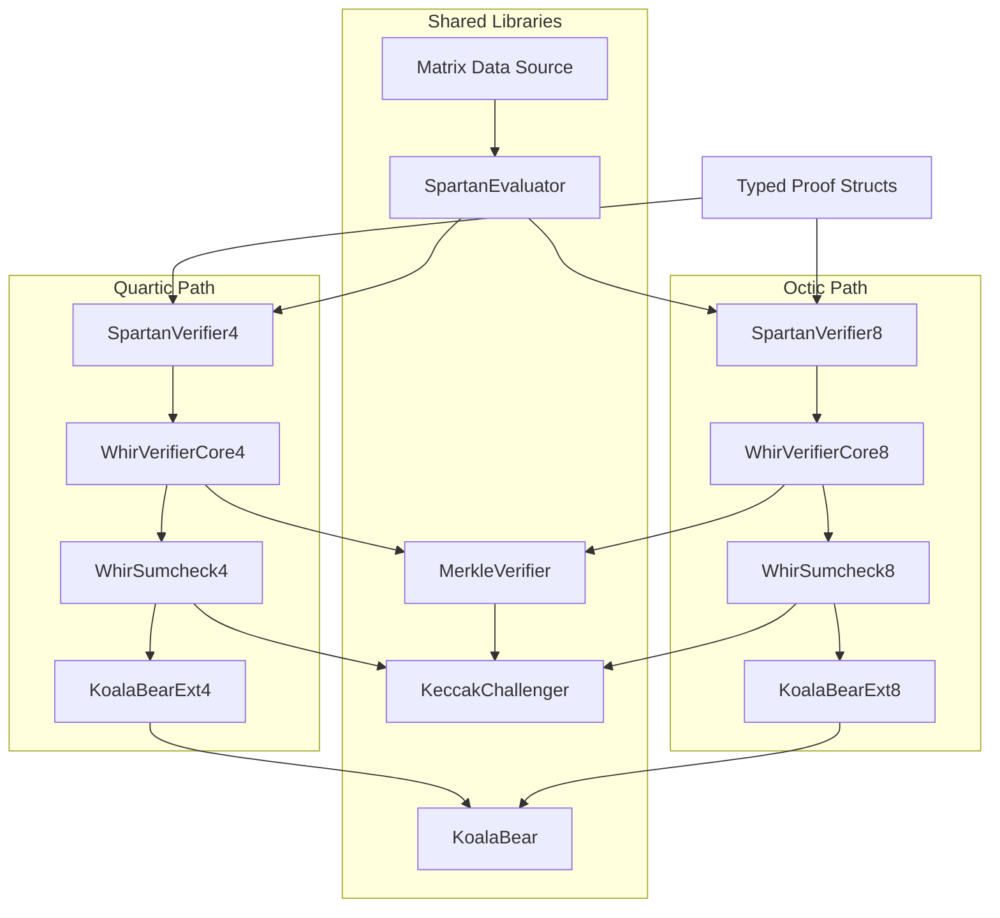

# Spartan-WHIR Solidity Verifier Implementation Plan

## Background

The `spartan-whir` Rust crate implements a SNARK (Succinct Non-interactive Argument of Knowledge) that combines:

- **Spartan**: an R1CS-based SNARK that reduces constraint satisfaction to polynomial evaluation claims via two sumcheck protocols (an outer cubic sumcheck and an inner quadratic sumcheck).
- **WHIR**: a polynomial commitment scheme (PCS) based on Reed-Solomon proximity testing. WHIR uses iterative folding rounds, each consisting of a Merkle commitment, out-of-domain (OOD) sampling, STIR query verification, and a folding sumcheck. It serves as the backend that opens the witness polynomial at the point produced by Spartan.

The base field is **KoalaBear** (p = 2^31 - 2^24 + 1, a 31-bit prime from the Plonky3 library). Algebraic security requires working over extension fields: degree-4 (quartic) or degree-8 (octic) binomial extensions of KoalaBear, both using the irreducible polynomial X^d - 3.

The goal of this plan is to build a **Solidity verifier** for this proof system, deployable on Ethereum-compatible EVM chains. The verifier must reproduce the exact Fiat-Shamir transcript and verification logic of the Rust implementation.

### Existing Codebases (in the same workspace)

- `./spartan-whir/` -- Rust SNARK implementation. Contains the protocol logic, proof encoding (`codec_v1.rs`), Keccak hashing (`hashers.rs`), domain separator (`domain_separator.rs`), and the WHIR PCS integration (`whir_pcs.rs`). This is the **source of truth** for all verification logic.
- `./whir-p3/` -- Rust WHIR library used by `spartan-whir`. Contains the WHIR verifier (`whir/verifier/mod.rs`), sumcheck verifier (`whir/verifier/sumcheck.rs`), Merkle multiproof verification (`whir/merkle_multiproof.rs`), proof types (`whir/proof.rs`), and expanded config derivation (`whir/parameters.rs`).
- `./Plonky3/` -- Vendored Plonky3 library. Contains the KoalaBear field definition (`koala-bear/src/koala_bear.rs`) and extension field arithmetic (`field/src/extension/binomial_extension.rs`).
- `./sol-whir/` -- An older Solidity verifier for a **different** version of WHIR over the BN254 field. Useful as a **structural reference** for Foundry project layout, gas measurement patterns, Merkle queue-based multiproof verification, and test harness design. **Not usable as a logic source** because its WHIR state machine matches the older `whir-old` Rust implementation, not the current `whir-p3`.
- `./whir-old/` -- Older Rust WHIR implementation (BN254-based). Only useful as a workflow reference for the fixture export pipeline. Not a schema or logic reference.

## Summary

Create a new Foundry (Solidity) project at `./sol-spartan-whir/`. Canonical protocol logic stays in `./spartan-whir/`. Fixture export and Solidity code generation live in a separate Rust workspace crate at `./spartan-whir-export/`.

Implementation order:

1. Freeze the ABI schema, set up the Foundry project, build the Rust fixture exporter
2. Implement KoalaBear base-field and extension-field arithmetic in Solidity
3. Implement the Keccak transcript challenger, validated against exported Rust traces
4. Implement the Merkle multiproof verifier
5. Implement the standalone WHIR verifier (quartic first, then octic)
6. Implement the full Spartan verifier on top of standalone WHIR
7. Gas optimization pass
8. Add a binary blob wrapper over the typed verifier for calldata optimization

The internal architecture supports **octic (degree-8) extensions from the start**, but the first working verifier targets **quartic (degree-4) standalone WHIR**.

## Source-of-Truth Boundaries

**Use `./sol-whir/` only for structural reference:**

- Foundry project layout and configuration patterns
- Gas measurement harness (`vm.startSnapshotGas` / `vm.stopSnapshotGas`)
- Merkle queue-based multiproof verification structure
- Test and deployment script patterns

**Do not use `./sol-whir/` as a logic source.** Its WHIR verification state machine corresponds to `./whir-old/`, not the current `./whir-p3/`.

**Use the current Rust code as the logic source for all verification logic:**

- WHIR verifier: [whir-p3/src/whir/verifier/mod.rs](whir-p3/src/whir/verifier/mod.rs), [whir-p3/src/whir/verifier/sumcheck.rs](whir-p3/src/whir/verifier/sumcheck.rs)
- WHIR PCS integration (split `parseCommitment` / `finalize` API): [spartan-whir/src/whir_pcs.rs](spartan-whir/src/whir_pcs.rs)
- Spartan verifier: [spartan-whir/src/protocol.rs](spartan-whir/src/protocol.rs), [spartan-whir/src/sumcheck.rs](spartan-whir/src/sumcheck.rs)
- Spartan domain separator: [spartan-whir/src/domain_separator.rs](spartan-whir/src/domain_separator.rs)
- Keccak hashing and digest masking: [spartan-whir/src/hashers.rs](spartan-whir/src/hashers.rs)
- Merkle multiproof algorithm: [whir-p3/src/whir/merkle_multiproof.rs](whir-p3/src/whir/merkle_multiproof.rs)
- Extension field constants and arithmetic: [Plonky3/koala-bear/src/koala_bear.rs](Plonky3/koala-bear/src/koala_bear.rs), [Plonky3/field/src/extension/binomial_extension.rs](Plonky3/field/src/extension/binomial_extension.rs)

**Use `./whir-old/` proof-converter only as a workflow reference** for how fixture export pipelines are structured. It is not a schema or format reference for the current proof format.

## Locked Decisions

- **Fresh implementation.** Do not refactor `./sol-whir/` in place. Write new Solidity code, referencing `./sol-whir/` only for structural patterns.
- **Typed ABI first.** The first working verifier uses Solidity structs with standard ABI encoding. The Rust exporter produces binary `abi.encode(...)` payloads using the `alloy-sol-types` library. Solidity tests load these via `vm.readFileBinary` and decode with `abi.decode(...)`. Custom binary encoding (the `SPWB` blob format) is added later as an optimization wrapper in Stage 7.
- **Standalone WHIR first.** Build and validate the WHIR polynomial commitment verifier before adding the Spartan layer. The WHIR verifier is the more complex component and accounts for most of the gas cost.
- **Quartic first, octic second.** Quartic extensions (4 coefficients per element) are simpler to implement and debug. Octic extensions (8 coefficients) are added before the full Spartan verifier is considered complete.
- **Two concrete verifier families via template-generated specialization.** Solidity has no generics. Extension-dependent modules (`WhirVerifierCore`, `WhirSumcheck`, `SpartanSumcheck`) are written as templates with a placeholder extension library import. The `spartan-whir-export` crate performs simple string substitution to produce two specialized copies (e.g., `WhirVerifierCore4.sol` and `WhirVerifierCore8.sol`) with the correct extension library wired at code-generation time. Extension-independent modules (`KeccakChallenger`, `MerkleVerifier`, `KoalaBear`, `SpartanEvaluator`) are shared. There is no runtime branching or virtual function dispatch on extension degree.
- **Standalone WHIR has two contract types:**
  - **Runtime-config verifiers** (`WhirVerifierDebug4.sol` / `WhirVerifierDebug8.sol`): accept `ExpandedWhirConfig` and `WhirStatement` as runtime ABI inputs. Used for testing and debugging across different WHIR configurations without recompilation.
  - **Fixed-config verifiers** (`WhirVerifier4.sol` / `WhirVerifier8.sol`): all config values are compile-time constants. Used for gas benchmarks and production deployment.
- **Schedule-generic verifier core from the start.** The first standalone WHIR verifier core is implemented against the derived round schedule (`roundParameters`, `finalSumcheckRounds`, and any explicit final-phase schedule fields exported later if needed). Do **not** build a constant-only core first and generalize it later. The Schedule Tuning Pass chooses which schedule is frozen into fixtures and fixed-config wrappers; it does not change the core architecture target.
- **Circuit-specific full Spartan verifier via generated Solidity.** The Rust code-generation tool emits Solidity constant definitions and sparse R1CS matrix data for a specific circuit. The `SpartanEvaluator` reads this data to verify inner relation checks. For any non-trivial circuit, the matrix data will exceed the EVM's 24576-byte contract size limit if stored inline. Therefore, the `SpartanEvaluator` API is designed from the start to abstract over the data source: inline constants for small test circuits, auxiliary code-as-data contracts (read via `EXTCODECOPY`) for realistic circuits. This transition does not change the evaluator's function signatures.
- **Optimization after correctness.** The baseline arithmetic uses simple, obviously-correct modular reductions (one reduction per operation). Performance-critical functions ("hot kernels") are isolated as separate internal functions so that optimized versions (e.g., with delayed modular reduction) can replace them later without changing callers.

## Typed ABI Schema (Frozen)

All Solidity-facing proof and config structs are defined in Stage 0 before the Rust exporter is built. Both sides target the same schema. The Rust exporter and Solidity verifier must agree on these definitions exactly.

### Encoding conventions

- **Digests**: `bytes32`. Represents a Keccak-based Merkle digest (internally `[u64; 4]`, serialized as 32 bytes in big-endian u64 order, with trailing bytes masked to `effectiveDigestBytes`).
- **Base-field elements**: `uint256`. One KoalaBear element per word, right-aligned, value in `[0, p)` where p = 0x7f000001.
- **Extension-field elements**: `uint256`. One packed extension element per word. Quartic: 4 coefficients x 32 bits each = 128 bits used. Octic: 8 coefficients x 32 bits each = 256 bits used. Coefficient order within the word is big-endian (coefficient 0 in the most significant 32-bit slot).
- **Important**: the byte order used for packing extension elements into `uint256` words (the ABI representation) and the byte order used by the Keccak transcript challenger when serializing field elements are **independent**. Both must be matched against Rust traces separately. Do not assume they are the same.

### Proof structs

**QueryBatchOpening** (Merkle query opening for one round):

- `uint8 kind` -- `0` = base-field values, `1` = extension-field values. This tag is explicit (not inferred from round index) because the final query batch sits outside the round list and the distinction must remain explicit. Matches the Rust enum at [whir-p3/src/whir/proof.rs](whir-p3/src/whir/proof.rs) line 117 and the codec variant byte at [spartan-whir/src/codec_v1.rs](spartan-whir/src/codec_v1.rs) line 913.
- `uint256 numQueries`
- `uint256 rowLen`
- `uint256[] values` -- flat row-major array. For base queries, each value is one `uint256` base-field element. For extension queries, each value is one `uint256` packed extension element.
- `bytes32[] decommitments` -- Merkle sibling hashes for the multiproof.

**SumcheckData** (WHIR folding sumcheck data for one phase):

- `uint256[] polynomialEvals` -- c0 and c2 values interleaved: `[c0_round0, c2_round0, c0_round1, c2_round1, ...]`. Each value is an extension element. Total length = 2 number_of_rounds.
- `uint256[] powWitnesses` -- proof-of-work witnesses, one base-field element per round.

**WhirRoundProof** (data for one WHIR folding round):

- `bytes32 commitment` -- Merkle root for this round's committed table.
- `uint256[] oodAnswers` -- out-of-domain evaluation answers (extension elements).
- `uint256 powWitness` -- proof-of-work witness (base-field element).
- `QueryBatchOpening queryBatch` -- Merkle query opening for this round.
- `SumcheckData sumcheck` -- folding sumcheck data for this round.

**WhirProof** (complete WHIR proof):

- `bytes32 initialCommitment` -- Merkle root of the initial committed polynomial.
- `uint256[] initialOodAnswers` -- out-of-domain evaluation answers for the initial commitment (extension elements).
- `SumcheckData initialSumcheck` -- initial folding sumcheck data.
- `WhirRoundProof[] rounds` -- one entry per WHIR folding round.
- `uint256[] finalPoly` -- **required** (not optional). The full evaluation table of the final residual polynomial over the remaining Boolean hypercube (extension elements, length = `2^finalSumcheckRounds`). The prover always populates this field. The verifier will reject the proof if it is missing ([whir-p3/src/whir/verifier/mod.rs](whir-p3/src/whir/verifier/mod.rs) line 152). The Solidity verifier should also reject if the decoded length is not exactly `2^finalSumcheckRounds`. The same vector is used in two ways by the verifier: final STIR checks interpret it as coefficients of a univariate polynomial and evaluate it via Horner's method, while the final sumcheck check interprets it as multilinear hypercube evaluations and evaluates it at the final sumcheck point.
- `uint256 finalPowWitness` -- proof-of-work witness for the final phase.
- `bool finalQueryBatchPresent` -- `true` if `finalRoundConfig.numQueries > 0` in the config.
- `QueryBatchOpening finalQueryBatch` -- final STIR query opening. When `finalQueryBatchPresent` is `false`, this struct is present but contains empty/zero values.
- `bool finalSumcheckPresent` -- `true` if `finalSumcheckRounds > 0` in the config.
- `SumcheckData finalSumcheck` -- final sumcheck data. When `finalSumcheckPresent` is `false`, this struct is present but contains empty arrays.

**Note on nesting:** The typed ABI allows nested structs and dynamic arrays where needed (e.g., `WhirRoundProof[]` inside `WhirProof`). Within each struct, variable-length data uses flat arrays with explicit counts rather than deeper nesting. This schema prioritizes correctness and ease of debugging over calldata efficiency. Further flattening is deferred to the blob stage (Stage 7).

### Config and statement structs

**ExpandedWhirConfig** (for the runtime-config verifiers; matches the fully-expanded `WhirConfig` from [whir-p3/src/whir/parameters.rs](whir-p3/src/whir/parameters.rs) lines 43-72). The Rust exporter derives the expanded config by calling `WhirConfig::new(...)` and exports the **fully derived verifier-ready schedule** directly: all explicit WHIR folding rounds in `roundParameters`, plus an explicit `finalRoundConfig` for the final STIR phase. The Solidity verifier does **not** re-derive round parameters on-chain.

- `uint256 numVariables` -- number of variables in the committed multilinear polynomial.
- `uint256 securityLevel` -- target security level in bits.
- `uint256 maxPowBits` -- maximum allowed proof-of-work difficulty.
- `uint256 commitmentOodSamples` -- number of OOD samples for the initial commitment.
- `uint256 startingLogInvRate` -- log2 of the initial Reed-Solomon inverse rate.
- `uint256 startingFoldingPowBits` -- PoW bits for the initial folding phase.
- `uint256 rsDomainInitialReductionFactor` -- domain reduction factor for the first round.
- `uint256 finalSumcheckRounds` -- number of sumcheck rounds in the final phase.
- `uint8 soundnessAssumption` -- 0 = UniqueDecoding, 1 = JohnsonBound, 2 = CapacityBound. Included for completeness and diagnostics; the Solidity verifier consumes only the derived per-round fields, not this value directly.
- `uint32 merkleSecurityBits` -- Merkle tree security parameter. Included for diagnostics.
- `uint8 effectiveDigestBytes` -- number of non-masked bytes in each Merkle digest. Derived from `merkleSecurityBits` by the Rust exporter using [spartan-whir/src/hashers.rs](spartan-whir/src/hashers.rs) `effective_digest_bytes_for_security_bits` (line 23). The Solidity Merkle verifier uses this value for leaf hashing, node compression, and digest masking.
- `uint256[] whirFsPattern` -- the WHIR Fiat-Shamir domain-separator pattern. This is a sequence of base-field elements that the verifier observes into the challenger before processing the proof. The Rust exporter produces it by building the domain separator via `commit_statement` + `add_whir_proof` and serializing the resulting pattern ([whir-p3/src/fiat_shamir/domain_separator.rs](whir-p3/src/fiat_shamir/domain_separator.rs) line 86, [spartan-whir/src/whir_pcs.rs](spartan-whir/src/whir_pcs.rs) line 326). For fixed-config verifiers, this is a compile-time constant. For runtime-config verifiers, it is a runtime ABI input.
- `RoundConfig[] roundParameters` -- one entry per WHIR folding round, where each `RoundConfig` contains:
  - `uint256 powBits`
  - `uint256 foldingPowBits`
  - `uint256 numQueries`
  - `uint256 oodSamples`
  - `uint256 numVariables`
  - `uint256 foldingFactor`
  - `uint256 domainSize`
  - `uint256 foldedDomainGen` -- generator of the folded evaluation domain (a base-field element). Used to compute STIR challenge points as `foldedDomainGen^index mod p`.
- `RoundConfig finalRoundConfig` -- explicit derived config for the final STIR phase. This uses the same field layout as the ordinary WHIR rounds so the runtime-config verifier can consume one verifier-ready schedule shape throughout. `finalRoundConfig.numQueries` determines whether `finalQueryBatch` must be present. `finalSumcheckRounds` remains separate because it controls the size of `finalPoly` and the optional final sumcheck transcript/data.

**WhirStatement** (for the runtime-config verifiers; matches the point-evaluation claims produced by the Spartan layer):

- `uint256[][] points` -- each inner array is a multilinear evaluation point (extension elements).
- `uint256[] evaluations` -- claimed polynomial evaluations at the corresponding points (extension elements, one per point).

**SpartanInstance** (runtime input for the full Spartan verifier, separate from the proof):

- `uint256[] publicInputs` -- public inputs to the R1CS circuit (base-field elements).
- `bytes32 witnessCommitment` -- Merkle root digest of the committed witness polynomial.

**SpartanProof** (complete Spartan proof):

- `uint256[] outerSumcheckPolys` -- flat array of outer sumcheck round polynomials. Each round contributes 3 extension elements [h0, h2, h3] (`CubicRoundPoly`). Total length = 3 num_rounds_x.
- `uint256[3] outerClaims` -- the three outer sumcheck output claims (Az, Bz, Cz) as extension elements.
- `uint256[] innerSumcheckPolys` -- flat array of inner sumcheck round polynomials. Each round contributes 2 extension elements [h0, h2] (`QuadraticRoundPoly`). Total length = 2 num_rounds_y.
- `uint256 witnessEval` -- claimed witness polynomial evaluation at the inner sumcheck output point (extension element).
- `WhirProof pcsProof` -- the nested WHIR proof for the polynomial commitment opening.

The quartic and octic ABI layouts are identical. The only difference is how the `uint256` extension words are interpreted (4 vs 8 packed 32-bit coefficients). The extension degree is a config-level constant, not a runtime variant in the proof struct.

The full Spartan ABI (SpartanInstance + SpartanProof) is frozen before Stage 5 starts.

## Workspace Structure

```
spartan-p3/
+-- spartan-whir/         # Rust SNARK implementation (source of truth for protocol logic)
+-- spartan-whir-export/  # Rust crate for fixture export and Solidity code generation
|                         # depends on spartan-whir + alloy-sol-types
|                         # writes binary ABI-encoded test fixtures to sol-spartan-whir/testdata/
|                         # emits generated Solidity constants to sol-spartan-whir/src/generated/
|                         # emits template-specialized Core4/Core8 Solidity files
+-- whir-p3/              # Rust WHIR library (PCS backend)
+-- Plonky3/              # Vendored Plonky3 (field definitions and extension arithmetic)
+-- sol-spartan-whir/     # NEW Foundry project (Solidity verifier)
|   +-- foundry.toml
|   +-- src/
|   |   +-- field/
|   |   |   +-- KoalaBear.sol          # base-field arithmetic
|   |   |   +-- KoalaBearExt4.sol      # quartic extension arithmetic
|   |   |   +-- KoalaBearExt8.sol      # octic extension arithmetic
|   |   +-- transcript/
|   |   |   +-- KeccakChallenger.sol   # Fiat-Shamir transcript challenger
|   |   +-- merkle/
|   |   |   +-- MerkleVerifier.sol     # Merkle multiproof verification
|   |   +-- whir/
|   |   |   +-- WhirStructs.sol        # proof/config/statement struct definitions
|   |   |   +-- WhirSumcheck4.sol      # template-generated, uses KoalaBearExt4
|   |   |   +-- WhirSumcheck8.sol      # template-generated, uses KoalaBearExt8
|   |   |   +-- WhirVerifierCore4.sol  # template-generated, uses KoalaBearExt4
|   |   |   +-- WhirVerifierCore8.sol  # template-generated, uses KoalaBearExt8
|   |   |   +-- WhirVerifier4.sol      # quartic fixed-config wrapper (benchmarks/production)
|   |   |   +-- WhirVerifier8.sol      # octic fixed-config wrapper
|   |   |   +-- WhirVerifierDebug4.sol # quartic runtime-config verifier (runtime ExpandedWhirConfig)
|   |   |   +-- WhirVerifierDebug8.sol # octic runtime-config verifier (runtime ExpandedWhirConfig)
|   |   +-- spartan/
|   |   |   +-- SpartanStructs.sol     # Spartan-level struct definitions
|   |   |   +-- SpartanSumcheck4.sol   # template-generated, uses KoalaBearExt4
|   |   |   +-- SpartanSumcheck8.sol   # template-generated, uses KoalaBearExt8
|   |   |   +-- SpartanEvaluator.sol   # sparse matrix evaluator (data-source abstracted)
|   |   |   +-- SpartanVerifier4.sol   # quartic fixed-config wrapper
|   |   |   +-- SpartanVerifier8.sol   # octic fixed-config wrapper
|   |   +-- generated/                 # Rust-emitted circuit-specific constants
|   +-- test/
|   |   +-- field/                     # arithmetic differential tests
|   |   +-- transcript/                # transcript parity tests
|   |   +-- whir/                      # standalone WHIR success/failure tests
|   |   +-- spartan/                   # full Spartan success/failure tests
|   |   +-- gas/                       # gas snapshot benchmarks
|   +-- testdata/                      # binary ABI-encoded fixtures from Rust
|   +-- script/
|   +-- lib/                           # forge-std, solady
+-- sol-whir/             # old BN254 WHIR verifier (structural REFERENCE ONLY)
+-- whir-old/             # old WHIR Rust implementation (workflow REFERENCE ONLY)
```

## Small-Field Arithmetic Design

KoalaBear: p = 2^31 - 2^24 + 1 (31-bit prime, 0x7f000001).

Both quartic and octic extensions use the binomial irreducible polynomial X^d - 3, where d is the extension degree and W = 3 is the non-residue. The `mul_by_w` operation is therefore `a * 3 = a + a + a` (no modular multiplication needed). Reference: [Plonky3/koala-bear/src/koala_bear.rs](Plonky3/koala-bear/src/koala_bear.rs) lines 91-127.

- **Quartic (d=4):** 4 coefficients per element. Multiplication requires approximately 16 base-field multiplications plus W-scaling. Reference for the algorithm: [Plonky3/field/src/extension/binomial_extension.rs](Plonky3/field/src/extension/binomial_extension.rs) `quartic_mul`.
- **Octic (d=8):** 8 coefficients per element. Multiplication requires approximately 64 base-field multiplications plus W-scaling. Inversion uses tower decomposition (treating the octic extension as a quadratic extension of the quartic extension). Reference: same file, `octic_mul` (line 1250) and `octic_inv` (line 1298).

**Why small-field arithmetic helps on the EVM:** A KoalaBear base-field multiplication produces a 62-bit result (31 bits x 31 bits), which fits in a single EVM `uint256` word with room to spare. This means a `uint256` accumulator can hold the sum of many such products (up to ~2^194 of them) before requiring a single modular reduction. Inside hot loops -- such as the dot products within extension multiplication, or multilinear evaluation folds -- this allows accumulating many terms before one `mod` operation, significantly reducing gas compared to performing `mulmod` on every operation.

**Baseline approach (Stage 1):** The first implementation uses simple, obviously-correct reductions: each arithmetic operation reduces its result modulo p immediately. Performance-critical functions are isolated as separate internal functions so that optimized variants with delayed reduction can replace them later without changing their callers.

## Implementation Stages

### Stage 0: Freeze schema + Foundry setup + Rust export tooling

**Sequencing:**

1. Define the Solidity struct definitions (`WhirStructs.sol`, `SpartanStructs.sol`) matching the frozen ABI schema above. These structs are the shared contract between the Rust exporter and the Solidity verifier.
2. Initialize `./sol-spartan-whir/` with Foundry. Configuration: `solc = "0.8.28"`, `fs_permissions` for testdata access, `via_ir = true`. Install dependencies: `forge-std`, `solady` (provides `LibSort` for STIR query index sorting). Verify that `vm.readFileBinary` is available in the installed Foundry version.
3. Build the Rust exporter as a separate workspace crate (`./spartan-whir-export/`) that depends on both `spartan-whir` and `alloy-sol-types`. This keeps the ABI-encoding dependency out of the core cryptographic crate. If a separate crate is impractical, the exporter can be placed under `spartan-whir/examples/` with `alloy-sol-types` as a dev-dependency only. The exporter uses `alloy-sol-types` to produce `abi.encode(...)`-compatible binary payloads. No hand-written ABI encoding.

**Rust exporter outputs:**

- Quartic standalone WHIR success and failure fixtures (binary ABI-encoded, loaded in Solidity via `vm.readFileBinary` + `abi.decode`). The initial failure set should include at least:
  - tampered commitment
  - tampered STIR query opening with commitments and OOD answers left unchanged
  - tampered initial OOD answer (expected to surface as an OOD failure and/or downstream transcript mismatch)
- Transcript checkpoint traces: every `observe` and `sample` call recorded with the challenger state, for byte-level parity testing
- Field arithmetic test vectors: random tuples (a, b, a+b, a-b, ab, a^-1) for base field, quartic extension, and octic extension
- Merkle test vectors: leaf hashes, node compressions, multiproof verification cases
- The exact WHIR Fiat-Shamir domain-separator pattern (the `Vec<F>` from `DomainSeparator::observe_domain_separator`) for the chosen config, exported as a test vector. Record the pattern length in fixture metadata for bytecode-size estimation.
- Later (as needed by subsequent stages): octic WHIR fixtures, full Spartan fixtures, SPWB blobs

### Stage 1: Arithmetic layer

- `field/KoalaBear.sol`: base-field add, sub, mul, inv for p = 0x7f000001.
- `field/KoalaBearExt4.sol`: quartic extension arithmetic (first target).
- `field/KoalaBearExt8.sol`: octic extension arithmetic (added before the full Spartan verifier stage).
- Both extension libraries implement the same function interface: `add`, `sub`, `mul`, `inv`, `mul_by_w`.
- Isolate performance-critical functions as separate internal functions:
  - Coefficient unpack/pack (between packed `uint256` and individual coefficients)
  - Base-field multiply and reduce
  - Dot-product accumulation (in the baseline, this can stay inside `_mul_coeffs`. Later, in Stage 6, we can replace the internals of `_mul_coeffs` with a faster delayed-reduction version, or a fused version (combine multiple steps into one pass to avoid repeated unpack/pack and temporary intermediates), without changing callers.)
  - Multilinear fold and equality-polynomial evaluation helpers
  - Sumcheck round evaluation (`extrapolate_012`: Lagrange extrapolation through points 0, 1, 2)
- Validate representation choices (how coefficients are packed into `uint256`) with gas microbenchmarks.
- Early microbenchmark of `evaluate_hypercube_ext` (multilinear fold over 2^folding_factor points using extension arithmetic). This is expected to be the single most expensive function in the WHIR verifier. Profile its gas cost before building the full verifier.
- All arithmetic must pass differential tests against the Rust-exported test vectors.

### Stage 2: Challenger / transcript parity

- Start this stage with transcript traces generated from the current Rust baseline schedule (`FoldingFactor::Constant(whir.folding_factor)`). The challenger implementation itself is schedule-agnostic; if the schedule is changed later, regenerate the traces for the chosen schedule and rerun the same parity tests.
- Implement `KeccakChallenger.sol` to match the behavior of the Rust `SerializingChallenger32<KoalaBear, HashChallenger<u8, Keccak256Hash, 32>>` path used by `spartan-whir`.
- **Do not implement the challenger from documentation or memory. Implement it from exported Rust transcript traces.** The only safe specification is "the Solidity challenger must produce the exact same observe/sample sequence as the Rust challenger, byte for byte, on the same inputs."
- Spartan transcript context observation (reference: [spartan-whir/src/protocol.rs](spartan-whir/src/protocol.rs) lines 313-318):
  1. Build the 76-byte `DomainSeparator::to_bytes()` preimage from the canonical R1CS shape, security config, and WHIR parameters.
  2. Compute `keccak256(preimage)` to produce a 32-byte digest.
  3. Observe that **32-byte digest** (as a `Hash<F, u8, 32>` object) into the challenger. Do **not** observe the raw 76-byte preimage.
  4. Observe each public input as a base-field element.
- WHIR domain-separator observation: Stage 0 exports the exact WHIR Fiat-Shamir pattern for each config. The fixed-config verifiers bake this pattern as a compile-time constant. The runtime-config verifiers receive it as part of the `ExpandedWhirConfig` runtime ABI input (`uint256[] whirFsPattern`).
- Tests must compare observe-sequence parity, challenge-sequence parity, and full checkpoint parity against fixed Rust-generated fixtures.

### Stage 3: Merkle layer

- Implement domain-prefixed Keccak leaf and node hashing with digest masking.
- Leaf hash: `keccak256(0x00 || field_elements_as_big_endian_u32...)`, then mask all bytes beyond `effectiveDigestBytes` to zero. Reference: [spartan-whir/src/hashers.rs](spartan-whir/src/hashers.rs).
- Node compression: `keccak256(0x01 || left_32_bytes || right_32_bytes)`, then apply the same digest masking.
- Queue-based multiproof verification. The structural pattern comes from [sol-whir/src/merkle/MerkleVerifier.sol](sol-whir/src/merkle/MerkleVerifier.sol). The algorithm reference is [whir-p3/src/whir/merkle_multiproof.rs](whir-p3/src/whir/merkle_multiproof.rs).
- Validate Merkle root computation, query ordering, and multiproof shape against Rust-generated fixtures.
- The Merkle verifier expects **sorted** query indices. Sorting is performed by the WHIR verifier core (Stage 4) using Solady's `LibSort`, not by the Merkle verifier itself.

### Stage 4: Standalone WHIR verifier

Split the verifier into these Solidity files:

- `WhirSumcheck4.sol` / `WhirSumcheck8.sol`: sumcheck verification logic, template-generated with the correct extension library.
- `WhirVerifierCore4.sol` / `WhirVerifierCore8.sol`: round parsing, STIR query processing, fold computation, constraint evaluation, template-generated.
- `WhirVerifier4.sol` / `WhirVerifier8.sol`: thin wrappers with fixed (compile-time) configuration for gas benchmarks and production use.
- `WhirVerifierDebug4.sol` / `WhirVerifierDebug8.sol`: runtime-config verifiers that accept `ExpandedWhirConfig` + `WhirStatement` as runtime ABI inputs.

The runtime-config verifier core must be schedule-generic at the round level: it reads the derived verifier-ready schedule from the expanded config rather than assuming that one global scalar applies to every round. In the current schema that means `roundParameters[i]`, `finalRoundConfig`, and `finalSumcheckRounds`. Fixed-config wrappers may still bake the chosen schedule as compile-time constants.

The verification logic is based on the current `whir-p3` verifier ([whir-p3/src/whir/verifier/mod.rs](whir-p3/src/whir/verifier/mod.rs)), not the older `sol-whir`.

**Input range validation:** Base-field arithmetic (`KoalaBear.add`/`sub`/`mul`) assumes inputs are in `[0, p)` and does not check. This is safe for internally-produced values (all operations produce reduced outputs), but ABI-decoded proof data enters the field layer at the Stage 4 boundary. The proof-decode entry point must validate that every base-field element and every packed extension coefficient is `< MODULUS` before passing values into arithmetic. This is a system-boundary check, not a per-operation check.

**Stack depth and memory management:** The WHIR verification loop maintains many simultaneous variables: challenger state, running claimed evaluation, folding randomness accumulated across rounds, domain parameters, constraint state, and parsed commitment data. Solidity's 16-variable stack limit will require scoped blocks, memory structs, and helper functions in the baseline implementation. This is a structural requirement for the code to compile, not a deferred optimization. Memory-budget profiling (tracking temporary array sizes and peak memory usage) should be part of baseline gas measurement.

**PCS split semantics** (required for later Spartan integration):

The Solidity WHIR verifier exposes the same two-phase API as the Rust implementation in [spartan-whir/src/whir_pcs.rs](spartan-whir/src/whir_pcs.rs):

- **parseCommitment** (Rust: lines 147-166): observes the WHIR Fiat-Shamir domain-separator pattern into the challenger, parses the initial commitment (observes the Merkle root, samples OOD challenge points, observes OOD answers), and checks that the root matches the expected commitment. Returns a parsed-commitment state object. Does **not** run the initial sumcheck. Note: the Rust implementation rebuilds the full `WhirConfig` from base parameters at this point. The Solidity implementation instead consumes the `ExpandedWhirConfig` and `whirFsPattern` directly, without re-deriving anything.
- **finalize** (Rust: lines 168-189): given the parsed commitment and the user's evaluation statement, runs `Verifier::verify`, which executes the full WHIR verification loop (initial sumcheck, per-round STIR + sumcheck, final check).

This split exists because the full Spartan verifier interleaves its own logic between the two phases: it calls `parseCommitment`, then runs the Spartan outer and inner sumchecks, then calls `finalize`. The standalone WHIR verifier simply calls both phases in sequence.

The full WHIR verification loop inside `finalize` (from [whir-p3/src/whir/verifier/mod.rs](whir-p3/src/whir/verifier/mod.rs)):

1. Merge the parsed commitment's OOD statement with the user-provided evaluation statement.
2. Build the initial constraint (`EqStatement` + `SelectStatement`), compute `combine_evals`.
3. Run the initial sumcheck using the first-round folding schedule for the chosen config (for today's Rust wiring this is the single `folding_factor`; under `ConstantFromSecondRound` it is the first-round factor).
4. For each WHIR round: fetch that round's derived parameters from `roundParameters`, parse the round commitment, check proof-of-work, sample STIR query indices (sample random bits from the challenger, construct indices, sort and deduplicate using Solady's `LibSort`), verify the Merkle multiproof (expects sorted indices), compute fold values via `evaluate_hypercube_ext` on the opened leaf rows, build the round's constraint, run the round's sumcheck.
5. Final phase: observe the final polynomial into the challenger, verify final STIR queries, run the optional final sumcheck (if `finalSumcheckRounds > 0`), check the closing equation via `ConstraintPolyEvaluator`.

**Milestones:**

1. Quartic standalone WHIR verifier passes Rust success fixtures.
2. Quartic verifier correctly rejects tampered proofs: tampered commitment, tampered initial OOD answer / transcript mismatch, tampered STIR query opening, tampered Merkle path or query data, tampered sumcheck data, transcript mismatch.
3. Quartic runtime-config verifier correctly rejects config mismatches: wrong `whirFsPattern`, wrong `effectiveDigestBytes`, wrong round parameters or query counts, wrong `finalRoundConfig.numQueries` or `finalSumcheckRounds` presence expectations.
4. Octic standalone WHIR verifier passes using the same core logic with `WhirVerifier8.sol`.
5. Gas benchmarks for both quartic and octic configurations.

### Schedule Tuning Pass (after Stage 4, before Stage 5)

The verifier core is schedule-generic regardless of which schedule is selected. This pass decides which schedule is frozen into the remaining fixtures, benchmarks, and any fixed-config wrappers after we already have a working standalone WHIR verifier and first gas numbers.

1. Use the current Rust `FoldingFactor::Constant(whir.folding_factor)` schedule as the baseline implementation path through Stages 2-4.
2. After Stage 4 is passing, compare the current baseline against candidate schedules on the same statements and security settings. Start with the current `Constant(4)` baseline and, if valid for the chosen statements, `ConstantFromSecondRound(3,4)` as the first candidate. This is not a claim that `(3,4)` is always optimal; it is the first comparison point because it perturbs only the first round while keeping the later-round factor at `4`, which keeps the search space small and isolates whether "smaller first fold, same later folds" helps.
3. For each candidate, generate real typed-ABI fixtures and record:
   - proof bytes
   - number of WHIR rounds
   - per-round folding factors and opened leaf widths (`2^foldingFactor`)
   - per-round query counts and OOD sample counts
   - `finalSumcheckRounds`
   - `finalPoly.length`
4. Run the same standalone runtime-config verifier on those fixtures and compare actual verifier gas, not just Rust-side proof metrics.
5. Use verifier-work proxies only as supporting diagnostics:
   - Merkle/query workload proxy: `sum(numQueries * 2^foldingFactor)` across all rounds
   - hypercube-fold workload proxy: same per-round opened leaf widths
   - final-phase workload proxy: `finalPoly.length` and `finalSumcheckRounds`
6. Decision rule: switch schedules only if proof bytes decrease materially and runtime-config verifier gas does not clearly worsen. If results are mixed, keep `Constant`.
7. Freeze the chosen schedule before Stage 5, Stage 6 optimization work, Stage 7 blob benchmarking, and any production-shaped fixed-config wrappers.
8. If a `ConstantFromSecondRound` schedule wins and is adopted:
   - update Rust-side config construction to build that schedule
   - regenerate expanded-config fixtures, `whirFsPattern`, and transcript traces
   - ensure the exported config surface continues to describe the chosen schedule fully in verifier-ready form (`roundParameters`, `finalRoundConfig`, `finalSumcheckRounds`)
   - rerun Stage 2 and Stage 4 test/benchmark coverage on the chosen schedule
   - regenerate any fixed-config Solidity wrappers/constants for the chosen schedule

### Stage 5: Full Spartan verifier

Add the Spartan layer on top of the standalone WHIR verifier. The Spartan verification flow matches [spartan-whir/src/protocol.rs](spartan-whir/src/protocol.rs) `verify`:

1. **Spartan context observation**: compute `keccak256(DomainSeparator::to_bytes())`, observe the 32-byte digest into the challenger, then observe each public input as a base-field element (as described in Stage 2).
2. **WHIR parseCommitment**: observe the WHIR Fiat-Shamir domain-separator pattern, parse the Merkle root and OOD data. No sumcheck runs here.
3. **Outer cubic sumcheck**: verify the outer sumcheck round polynomials. Each round sends `CubicRoundPoly([h0, h2, h3])` (3 extension elements). The verifier observes these, samples a challenge, and updates the running claim.
4. **Outer relation check**: verify that `eq_point_eval(tau, r_x) * (az * bz - cz) == final_outer_claim`.
5. **Inner quadratic sumcheck**: verify the inner sumcheck round polynomials. Each round sends `QuadraticRoundPoly([h0, h2])` (2 extension elements).
6. **Inner relation check**: compute `evaluate_with_tables` for sparse R1CS matrix evaluation, recover the witness evaluation.
7. **WHIR finalize**: run the full WHIR verification loop (initial sumcheck through closing equation).

**Circuit-specific design via generated Solidity:** The `spartan-whir-export` tool generates Solidity files into `src/generated/` containing:

- Canonical R1CS shape metadata: `num_cons`, `num_vars`, `num_io`.
- Fixed security and WHIR parameters.
- Precomputed 32-byte Spartan domain-separator hash constant (the result of `keccak256(DomainSeparator::to_bytes())`). The 76-byte preimage can also be exported for parity tests.
- The WHIR Fiat-Shamir domain-separator pattern (as a constant `uint256[]`).
- Sparse R1CS matrix data for A, B, C in **COO (coordinate list) format**: three flat arrays per matrix (`uint256[] rows`, `uint256[] cols`, `uint256[] vals`) matching the Rust `SparseMatEntry { row, col, val }` layout from [spartan-whir/src/r1cs.rs](spartan-whir/src/r1cs.rs) lines 8-19. Also includes matrix dimensions (`numRows`, `numCols`, number of non-zero entries per matrix).

**Baseline evaluator** (`SpartanEvaluator.sol`): a shared generic sparse matrix evaluator that computes `sum(t_x[rows[i]] * t_y[cols[i]] * vals[i])` over the COO data. This matches the Rust `evaluate_sparse_matrix_with_tables` function at [spartan-whir/src/r1cs.rs](spartan-whir/src/r1cs.rs) lines 275-293. The evaluator API is abstracted over the data source:

- **Small test circuits**: COO data as inline `constant` arrays in the generated constants contract.
- **Realistic circuits**: COO data in auxiliary code-as-data contracts, read via `EXTCODECOPY` at an address passed to the evaluator at construction time.
- The evaluator function signatures stay the same across both modes.

Inline COO constants will exceed the EVM's 24576-byte contract size limit for any non-trivial circuit (e.g., 1000 non-zero entries per matrix x 3 matrices x 3 arrays x 32 bytes = approximately 288 KB). Inline constants are expected to work only for small test circuits. For realistic circuits, auxiliary data contracts are the expected production path.

Consider switching from the generic COO evaluator to unrolled straight-line evaluator code (generated by Rust) only if gas profiling in Stage 6 shows the generic evaluator is a significant cost center.

Separate thin wrappers: `SpartanVerifier4.sol` (quartic) and `SpartanVerifier8.sol` (octic).

Runtime verifier input: `SpartanInstance` (public inputs + witness commitment) + `SpartanProof`.

**Bytecode-size and deployment-gas check** (required after baseline code generation is working): measure runtime bytecode size, initcode size, and deployment gas. Memory-budget profiling (peak memory usage, temporary array sizes) should accompany these measurements.

**Milestones:**

1. Quartic full Spartan verifier passes Rust success fixtures.
2. Correct rejection on: tampered outer claims, tampered inner sumcheck, tampered witness evaluation, tampered PCS proof, wrong public inputs.
3. Octic full Spartan verifier passes.
4. Bytecode size and deployment gas measured and within acceptable limits (or auxiliary data contracts deployed as mitigation).

### Stage 6: Gas optimization pass

After quartic + octic standalone WHIR and full Spartan verifiers all pass:

- Profile gas breakdown per component to identify the most expensive functions.
- Optimize only measured hotspots:
  - Delayed modular reduction in base-field accumulation (accumulate 62-bit products in a `uint256` before reducing once).
  - Extension multiplication accumulation.
  - Multilinear fold kernels (`evaluate_hypercube_ext`).
  - Sumcheck round evaluation (`extrapolate_012`).
  - Merkle hashing and memory management (inline assembly).
- If profiling shows the generic COO sparse evaluator is a significant cost center, consider replacing it with unrolled straight-line code generated by the Rust tool.
- **Octic inversion** (`ext8Inv`): Stage 1 baseline uses the generic Frobenius-norm loop (7 iterations of Frobenius + full extension mul), costing ~217k gas vs ~29k for quartic. Plonky3 has an optimized `quartic_inv` using a tower decomposition `F < F[X²−W] < F[X⁴−W]`; an analogous octic tower (quartic over quadratic) could cut this significantly. Low priority unless profiling shows inversions are a material fraction of total verifier gas.

**Stage 1 baseline gas (from FieldHarness, includes external call overhead):**

| Operation              | Ext4        | Ext8        |
| ---------------------- | ----------- | ----------- |
| add                    | 2.4k        | 4.3k        |
| sub                    | 2.7k        | 4.1k        |
| mul                    | 9.0k        | 31.8k       |
| inv                    | 28.7k       | 216.6k      |
| pack / unpack          | 2.1k / 1.8k | 3.4k / 3.2k |
| evaluate_hypercube(16) | 199k        | 592k        |
| extrapolate_012        | 66k         | 215k        |
| eq_poly_eval(3)        | 76k         | 155k        |

- **Every optimization requires:**
  - Differential tests against the unoptimized baseline kernel.
  - Before/after gas snapshots on identical fixtures.
  - Verification that the function interface has not changed.

### Stage 7: Blob wrapper / calldata optimization

After the typed verifier is working and gas-optimized:

- Add a Solidity decoder/wrapper for the `SPWB` v1 binary blob format (reference: [spartan-whir/src/codec_v1.rs](spartan-whir/src/codec_v1.rs)). The blob wrapper decodes the binary proof into the typed structs and delegates to the already-validated typed verifier. It does not reimplement any verification logic.
- Use Rust-exported real SPWB blobs for testing.
- Benchmark both entry points on the same fixtures:
  - Typed ABI calldata: execution gas, calldata size in bytes, calldata gas cost, total estimated transaction cost.
  - Blob calldata: same metrics.
- Keep both entry points available: the typed verifier as a reference and debug path, the blob wrapper as the optimized path if it reduces total cost.
- Test strict rejection of malformed blobs (wrong magic, wrong version, wrong header fields).

## Architecture Diagram



## Test Matrix

- **Field arithmetic** (Stage 1): quartic and octic differential tests against Rust-exported test vectors.
- **Transcript** (Stage 2): exact observe/sample checkpoint parity against Rust traces. Spartan domain-separator hash parity. WHIR Fiat-Shamir domain-separator pattern parity (validated against exported pattern, not re-derived in Solidity).
- **Merkle** (Stage 3): leaf hash, node compression, multiproof verification against Rust fixtures.
- **Standalone WHIR** (Stage 4):
  - Successful verification (quartic, octic).
  - Rejection of tampered commitment.
  - Rejection of tampered initial OOD answer / transcript mismatch.
  - Rejection of tampered STIR query opening.
  - Rejection of tampered Merkle path or query data.
  - Rejection of tampered sumcheck data.
  - Rejection on final-check failure.
  - Rejection on transcript mismatch.
  - Runtime-config verifier config-mismatch rejection: wrong `whirFsPattern`, wrong `effectiveDigestBytes`, wrong round parameters or query counts, wrong `finalRoundConfig.numQueries` or `finalSumcheckRounds` presence expectations.
- **Full Spartan** (Stage 5):
  - Successful verification (quartic, octic).
  - Rejection of tampered outer claims.
  - Rejection of tampered inner sumcheck.
  - Rejection of tampered witness evaluation.
  - Rejection of tampered PCS proof.
  - Rejection on wrong public inputs.
- **Blob wrapper** (Stage 7): decode-and-delegate parity with the typed verifier path. Malformed blob rejection. Wrong version or header rejection.
- **Gas benchmarks** (Stages 6-7): snapshot benchmarks on fixed fixtures for quartic and octic standalone WHIR, quartic and octic full Spartan, typed ABI vs blob calldata.

## Gas Measurement

- Use Foundry's `vm.startSnapshotGas` / `vm.stopSnapshotGas` around the verifier call.
- Report per benchmark: **execution gas**, **calldata size in bytes**, **calldata gas cost estimate**, **total estimated transaction cost**.
- Separate benchmark families: quartic standalone WHIR, octic standalone WHIR, quartic full Spartan, octic full Spartan.
- Use fixed Rust-generated benchmark fixtures so all gas comparisons use identical inputs.
- Track typed-ABI and blob-wrapper results separately once both entry points exist.

## Assumptions

- First correctness milestone is **quartic standalone WHIR**.
- Octic support is required in the near term. The internal architecture supports it from the start.
- Quartic and octic verifiers are separate concrete contracts, not one contract branching at runtime.
- Standalone WHIR provides both runtime-config verifiers (runtime `ExpandedWhirConfig`) and fixed-config verifiers (compile-time constants).
- The full Spartan verifier is circuit-specific, with Rust-generated Solidity constants.
- Baseline evaluator: shared generic library with COO data-source abstraction. Inline constants for small test circuits, auxiliary data contracts for realistic circuits. Not replaced with unrolled code unless gas measurements require it.
- The typed ABI with `abi.encode`/`abi.decode` is the first correctness path. Binary blob decoding is a later calldata optimization.
- `./sol-whir/` is a structural reference only, not a logic source. `./whir-p3/` and `./spartan-whir/` are the logic sources.
- The WHIR Fiat-Shamir domain-separator pattern is exported from Rust and provided as a constant or runtime input. It is not re-derived in Solidity.
- The Spartan domain-separator is stored as a precomputed 32-byte hash constant in generated code. The 76-byte preimage is exported separately for parity tests only.
- The `QueryBatchOpening` base-vs-extension variant uses an explicit `kind` tag in the typed ABI, matching the Rust proof format.
- `final_poly` is required in the typed ABI (the verifier rejects proofs where it is missing). It is the full evaluation table of the final residual polynomial. The verifier uses the same vector both for final STIR checks (as univariate coefficients evaluated via Horner) and for the final sumcheck check (as multilinear hypercube evaluations). `final_query_batch` and `final_sumcheck` use explicit `bool present` flags; presence is determined by config (`finalRoundConfig.numQueries > 0` and `finalSumcheckRounds > 0` respectively).
- Current `spartan-whir` wiring uses `FoldingFactor::Constant`, because the public config surface exposes only one `whir.folding_factor` scalar and `build_whir_config` maps that scalar directly to `FoldingFactor::Constant` ([spartan-whir/src/whir_pcs.rs](spartan-whir/src/whir_pcs.rs) line 311). The Solidity runtime-config verifier core is intentionally planned to be schedule-generic from the first implementation: it should consume the fully derived verifier-ready schedule (`roundParameters`, `finalRoundConfig`, `finalSumcheckRounds`), so that adopting `ConstantFromSecondRound` does not require rewriting the core verification loop or changing the proof ABI. What does change is the derived config, the WHIR Fiat-Shamir pattern, fixed-config wrappers/constants, and any exported schedule fields/artifacts that must be regenerated for the chosen schedule. Follow the Schedule Tuning Pass after Stage 4 baseline correctness/gas and before Stage 5+: compare proof bytes and actual standalone verifier gas, then freeze the schedule and regenerate the affected fixtures/artifacts for the chosen schedule.
- The WHIR Fiat-Shamir domain-separator pattern is included in `ExpandedWhirConfig` as a runtime `uint256[]` field for the runtime-config verifiers, and baked as a compile-time constant for the fixed-config verifiers.
- Build and verify against `spartan-whir` without the `keccak_no_prefix` feature flag (default behavior: Keccak leaf and node hashing uses domain-separation prefix bytes `0x00` and `0x01`).
- STIR query index sorting uses Solady's `LibSort` or an equivalent sorting library. Sorting gas is a known cost factor.
- The WHIR Fiat-Shamir domain-separator pattern length should be recorded as part of Stage 0 fixture metadata for bytecode-size estimation.
- All extension-dependent Solidity files (`WhirVerifierCore`, `WhirSumcheck`, `SpartanSumcheck`) are template-generated into quartic and octic copies via simple string substitution in `spartan-whir-export`.
